# ExNex: A Proposed Framework for Patient-Centric Health Data Exchange

## Preamble
This document outlines a proposed framework, "ExchangeNext" (ExNex), for patient-centric health data exchange. It is intended to serve as a comprehensive overview to guide discussion, solicit feedback, and lay the groundwork for future specification development. It does not describe an existing product or a finalized standard.

---

## Part 1: Introduction – The ExNex Vision

### 1.1. The Current Landscape of Health Data Exchange
The ability to securely and efficiently share health information is fundamental to modern healthcare. However, current systems often present significant challenges. Data can be trapped in silos, making it difficult for clinicians to get a complete view of a patient's history, especially across different healthcare organizations. Patients frequently have limited direct control over their own health data and face hurdles in accessing it in a usable, computable format. Interoperability, while a long-stated goal, remains an ongoing effort, with true, seamless data flow often proving elusive. These limitations can impact the quality of care, frustrate patients and providers alike, and hinder innovation.

### 1.2. Introducing ExNex: A Framework for Modern Needs
The ExchangeNext (ExNex) framework is proposed to address these challenges by establishing a new approach to health data exchange.

*   **Core Vision:** ExNex aims to enable a health data ecosystem where information flows securely and efficiently to support optimal health outcomes, guided by patient consent and meaningful control.
*   **Fundamental Philosophy:** The framework is built on the belief that health data should primarily serve the patient, while also enabling the legitimate and consented needs of the broader healthcare ecosystem, including providers, payers, and researchers.

### 1.3. Key Principles of the ExNex Framework
ExNex is designed around several core principles:

*   **Patient Empowerment:** Providing individuals with direct, programmatic access to their health information and meaningful control over how it is shared.
*   **Decentralized Trust with Standardized Mechanisms:** Avoiding central data repositories and single points of failure for data itself. Instead, trust is established dynamically between participants using open standards and verifiable credentials.
*   **Purpose-Driven Access:** Data access rights and the rules governing exchange are explicitly tied to the declared reason for the request, ensuring clarity and appropriate handling.
*   **Sustainable Operations:** Designing an economic and operational model that supports widespread participation without imposing undue financial burdens for essential exchanges.
*   **Innovation at the Edge:** Providing a stable, trusted foundation upon which new applications and data use cases can be built with clear rules of engagement.

### 1.4. Primary Goals of ExNex
The ExNex framework seeks to achieve the following primary goals:

*   **Empower Patients:** Give individuals direct, programmatic access to their comprehensive health journey through applications and tools of their choice.
*   **Enable Treatment:** Ensure clinicians can securely and efficiently access the necessary patient data at the point of care to make informed decisions.
*   **Preserve Privacy:** Robustly enforce patient consent preferences (opt-in for sensitive uses, opt-out for others like treatment) using cryptographic methods and clear policy frameworks.
*   **Ensure Economic Sustainability:** Design an economic model where participation in mandatory data exchange (such as for treatment or individual access) is not an unsustainable cost burden for any single entity.
*   **Foster Innovation:** Allow new, optional use cases (e.g., research, advanced analytics) to emerge through well-defined purpose agreements built upon the core trust fabric.

### 1.5. How Success Will Be Measured
The success of an ExNex implementation will be gauged by:

*   **Clinical Impact:** High success rates and low latency for treatment-related data queries.
*   **Patient Empowerment:** Widespread adoption and use of individual data access tools (e.g., via Patient-Developer Credentials); patients actively reviewing audit logs and managing consent preferences.
*   **Privacy Protection:** Demonstrable enforcement of patient opt-outs and consent directives.
*   **Economic Sustainability:** Balanced participation costs for mandatory data exchange purposes.
*   **Ecosystem Growth:** Significant adoption by diverse healthcare stakeholders and the emergence of innovative applications leveraging ExNex.

### 1.6. Scope: What ExNex Addresses (and What It Doesn't)
ExNex focuses on establishing the "trust and transport" layer for health information exchange. It provides the rules, standards, and mechanisms for how participants can securely identify each other, verify authorization, and exchange data.

It does **not** aim to:

*   Dictate specific business models or optimize revenue for participants beyond ensuring sustainability for core functions.
*   Provide clinical decision support or interpret the clinical meaning of data (its focus is on exchange).
*   Mandate a single, universal patient matching solution, though it provides strong support for high-assurance identity verification and demographic matching.
*   Replace existing Health Information Systems (HIS) or Electronic Health Records (EHRs), but rather to enable them to interoperate more effectively within the ExNex framework.
*   Impose global data governance beyond its defined federation scope.

### 1.7. A High-Level Glimpse: ExNex in Action

Imagine a common scenario: Dr. Anya Sharma, a cardiologist, is about to see a new patient, Mr. David Chen, who has a complex cardiac history and was recently treated at another hospital during a vacation. To provide the best care, Dr. Sharma needs a comprehensive view of Mr. Chen's recent treatments, medications, and lab results from that out-of-town hospital.

In the ExNex Federation, Dr. Sharma's Electronic Health Record (EHR) system, acting as a **Data Requester**, initiates this process.

1.  **Stating the Need:** The EHR specifies the **`purpose_of_use`** as "Treatment." It also includes a clear, patient-facing **`rationale`**: "Dr. Sharma is requesting David Chen's recent cardiac records from Othertown General Hospital to prepare for his cardiology consultation on [Date]."

2.  **Proving Legitimacy:** The request is accompanied by **`justifications`**. These are like digital credentials that prove Dr. Sharma (or her clinic acting on her behalf) is a legitimate, licensed healthcare provider, and that they have an established relationship or valid reason (the upcoming appointment) to request Mr. Chen's data for treatment. If Mr. Chen had previously set specific consent preferences for "Treatment" data sharing (e.g., an opt-out), those would be respected.

3.  **Finding and Fetching:** Dr. Sharma's EHR might first query a **Record Locator Service (RLS)** within the ExNex federation to discover that "Othertown General Hospital" holds relevant records for Mr. Chen. Once located, the EHR sends a secure request directly to Othertown General Hospital's system (which acts as a **Data Responder**).

4.  **Verification at the Source:** Othertown General Hospital's system verifies Dr. Sharma's clinic's credentials and the `justifications` for the request through the ExNex trust fabric, built on open standards like **OpenID Federation (OIDF)**. It confirms the "Treatment" purpose and checks if Mr. Chen has opted out of such sharing (assume he hasn't for this critical care information).

5.  **Secure Data Return:** Upon successful verification, Othertown General Hospital securely transmits the relevant health information back to Dr. Sharma's EHR.

**The Patient's View: Transparency and Control**

This is where ExNex significantly differs from many traditional exchanges. Mr. Chen, the patient, isn't just a passive subject.

*   **Auditability:** Every step of this access by Dr. Sharma's clinic is logged by Othertown General Hospital. Later, Mr. Chen, using his preferred patient application, can review his **audit log**. He would see an entry indicating:
    *   *Who:* Dr. Sharma's Clinic.
    *   *When:* The date and time of access.
    *   *What:* Access to his health records.
    *   *Why (Purpose):* "Treatment."
    *   *Why (Rationale):* "Dr. Sharma is requesting David Chen's recent cardiac records from Othertown General Hospital to prepare for his cardiology consultation on [Date]."
*   **Empowerment:** This clear `rationale` provides meaningful context, far beyond a simple "data accessed for treatment." Furthermore, ExNex is designed so that Mr. Chen could, through a **Narrow-Waist Authorization (NW-AUTH) Service**, manage his broader sharing preferences (e.g., opting in or out of sharing for different purposes like research or routine treatment, distinct from emergency access).
*   **Direct Access:** Separately, Mr. Chen could use his own **Patient-Developer Credential (PDC)** with an app of his choice to directly access his records from Othertown General Hospital himself, without needing an intermediary.

This scenario illustrates the core principles: Data Requesters (like Dr. Sharma's EHR) must clearly state their purpose and provide verifiable justifications. Data Responders (like Othertown General Hospital) enforce access rules based on these elements and patient preferences. Specialized **Narrow-Waist Service Providers** help manage identity, credentials, and consent across the federation. And critically, the patient (Mr. Chen) is empowered with transparency through auditable logs and control over their data sharing preferences.

The rest of this document will delve into the specific mechanisms, standards, and roles that make this vision possible.

*   <diagram>A simple storyboard-style diagram illustrating the Dr. Sharma/Mr. Chen scenario:
    1.  Frame 1: Dr. Sharma at her EHR, speech bubble: "Need Mr. Chen's records from Othertown General for 'Treatment'. Rationale: upcoming consult."
    2.  Frame 2: ExNex Federation cloud icon with "OIDF Trust" and "VC Justifications" inside. Arrow from EHR to this cloud.
    3.  Frame 3: Othertown General Hospital system icon, verifying the request (checkmark).
    4.  Frame 4: Data flowing from Othertown General back to Dr. Sharma's EHR.
    5.  Frame 5: Mr. Chen on his phone/app, looking at an audit log entry: "Dr. Sharma's Clinic accessed for Treatment. Rationale: ...consult..."
    </diagram>

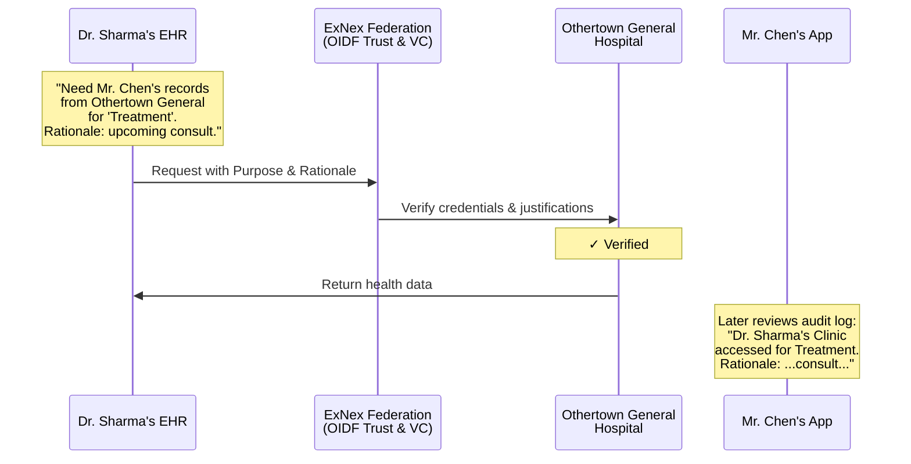

---

## Quick Reference Guide

### Key Participant Types and Responsibilities

| Participant Type | Primary Roles | Key Responsibilities |
|-----------------|---------------|---------------------|
| **Healthcare Providers** | Data Requester & Data Responder | Secure patient data, respond to mandatory access requests, maintain audit logs |
| **Payers/Health Plans** | Data Requester | Request data for payment operations and care coordination |
| **Patient-Facing Applications** | Data Requester | Access data on behalf of patients with appropriate consent |
| **Patients** | Data Subject & Requester (via PDC) | Manage consent preferences, access own data, review audit logs |
| **NW Service Providers** | Trust Infrastructure | Issue VCs, manage consent, verify identities |

### Purpose of Use Categories Summary

| Purpose | Consent Model | Responder Obligation | Typical Justifications |
|---------|---------------|---------------------|----------------------|
| **IndividualAccess** | Explicit opt-in* | Mandatory | PDC VC or Identity VC + Authorization VC |
| **Treatment** | Opt-out | Mandatory | Provider credentials + relationship claim |
| **Emergency** | Opt-out (separate) | Mandatory | Provider credentials + emergency flag |
| **PaymentOperations** | Opt-out | Optional (requires agreement) | Payer identity + member relationship |
| **PublicHealth** | No consent required | Mandatory | Requester identity + legal mandate |
| **Research** | Explicit opt-in | Optional (requires agreement) | Identity VC + Research Consent VC |

*PDC VC inherently includes opt-in for self-access

### Fee Structure Summary

| Access Type | Fee Policy | Notes |
|------------|------------|-------|
| **PDC Data Access** | FREE | No fees for patients accessing own data |
| **Mandatory Purposes** (Treatment, Emergency, IndividualAccess, PublicHealth) | FREE | No per-transaction fees allowed between participants |
| **Optional Purposes** (Research, some PaymentOperations) | Negotiable | May involve bilateral agreements with fees |
| **IAL2 Identity Verification** | One-time fee | Paid to NW-ID provider for PDC issuance |
| **Network Membership** | Variable | Networks may charge members for RLS and other services |

### Required Justifications by Purpose

| Purpose | Required Justifications |
|---------|------------------------|
| **IndividualAccess** | • PDC VC (for self-access)<br>• OR Identity VC + Authorization VC (for authorized apps) |
| **Treatment** | • Provider identity/license credentials<br>• Patient demographics for matching<br>• Treatment relationship attestation |
| **Emergency** | • Same as Treatment but with emergency flag<br>• Subject to separate opt-out list |
| **PaymentOperations** | • Payer identity credentials<br>• Member relationship attestation<br>• Active coverage verification |
| **Research** | • Patient Identity VC<br>• Research Consent VC with IRB reference<br>• Prior agreement with responder |

---

## Part 2: How ExNex Works – The Core Loop of Controlled Data Access

This part explains the fundamental cycle of how data access is requested, justified, approved, and audited within the ExNex framework. It introduces the key actors, the importance of "Purpose of Use," the concept of "Justifications," how economic realities are considered, and the critical role of patient auditability.

### 2.1. Participants in the ExNex Ecosystem

The ExNex Federation involves a variety of actors, each playing one or more roles:

*   **Healthcare Providers:** These include hospitals, clinics, individual practitioners, laboratories, and imaging centers. They are often both Data Responders (holding patient data) and Data Requesters (seeking data for treatment or other purposes).
*   **Payers/Health Plans:** Insurance companies and other entities responsible for payment and health plan operations. They typically act as Data Requesters for purposes like claims processing, quality measurement, or care coordination.
*   **Patient-Facing Applications:** Software applications used by patients to access and manage their health information. These can be:
    *   **Third-party applications:** Commercial or non-profit apps that patients authorize to act on their behalf.
    *   **Patient-developed/controlled applications:** Tools that individuals use or create for their personal health management, often leveraging the Patient-Developer Credential.
    These apps primarily act as Data Requesters.
*   **Patients:** Individuals are central to ExNex. They are the subjects of the health data and, increasingly, active participants in its exchange. They can directly authorize access, manage consent preferences, and, through programs like the Patient-Developer Credential, act as Data Requesters for their own information.
*   **Specialized Narrow-Waist (NW) Service Providers:** These are trusted, certified entities that offer critical infrastructure services to the federation, such as identity verification, credential issuance, and consent management. They are neither typical Requesters nor Responders of patient clinical data but are essential enablers of the ecosystem. (These will be detailed in Part 3).

**Roles within ExNex:**
It's important to distinguish between the type of organization and the functional role(s) they play in a given data exchange:

*   **Data Requester:** Any entity that initiates a request to access health data from another entity.
*   **Data Responder:** Any entity that holds health data and processes incoming requests, potentially sharing data if the request is valid and authorized.

Many participants will fulfill both roles. For example, a hospital is a Data Responder for its own patient records but acts as a Data Requester when seeking records from a patient's primary care physician. Patient applications are primarily Data Requesters, but a sophisticated patient app, with patient consent, could potentially act as a Data Responder for data the patient has aggregated and wishes to share further under controlled conditions.

### 2.2. The Starting Point: "Purpose of Use"
At the heart of every ExNex data exchange is the **`purpose_of_use`**. This is a clear declaration made by the Data Requester that specifies *why* they are seeking access to health information.

*   **Concept:** The `purpose_of_use` is not just a label; it's a fundamental control point in the framework.
*   **Why it Matters:** The declared `purpose_of_use` directly influences:
    *   **Consent Requirements:** It determines whether the patient needs to have explicitly opted-in for this type of sharing, or if sharing is permitted by default unless the patient has opted-out.
    *   **Responder Obligations:** It defines whether a Data Responder is generally obligated to fulfill a valid request or if they have discretion (e.g., requiring a pre-existing agreement).
    *   **Required Justifications:** Different purposes will necessitate different types of proof or `justifications` from the Requester.
    *   **Auditing:** It provides essential context for audit logs, helping patients and overseers understand the nature of an access event.

*   **Key Purpose Categories – A First Look:**
    ExNex defines a set of standard purpose categories. While the full list will be detailed later, some primary examples illustrate the concept:
    *   **`IndividualAccess`**: Used when a patient, or an application explicitly acting on their direct behalf (like one using their Patient-Developer Credential), requests access to that patient's own data.
    *   **`Treatment`**: Used by healthcare providers when accessing data to provide clinical care to a patient.
    *   **`Emergency`**: A special category for accessing data in urgent, life-threatening situations, potentially with different consent overrides than routine `Treatment`.
    *   **`PaymentOperations`**: Used by health plans for functions directly related to reimbursement, such as claims processing or verifying eligibility.
    *   **`PublicHealth`**: Used for legally mandated reporting of information to public health agencies (e.g., communicable disease reporting).
    *   **`Research`**: Used when accessing data for ethically approved research studies, typically requiring explicit patient opt-in consent.

### 2.3. Proving the "Right": Justifications for Access
Simply stating a `purpose_of_use` is not enough. The Data Requester must also provide **`justifications`** – verifiable attestations that demonstrate their legitimacy and authorization for making that specific request for that specific purpose.

*   **Concept:** Justifications are the "proof" that backs up the claimed `purpose_of_use`. They ensure that only authorized entities can access data and only for appropriate reasons.
*   **What Justifications Do:**
    *   **Confirm Requester Identity & Role:** They can prove the Requester is, for example, a licensed healthcare provider, a legitimate health plan, or a patient-authorized application.
    *   **Confirm Patient Identity:** When data for a specific individual is sought, justifications help confirm the identity of that patient, often to a high degree of assurance.
    *   **Provide Evidence of Consent:** For purposes requiring explicit patient opt-in, a justification might be a digital credential proving that consent was granted.
    *   **Assert a Valid Relationship:** They can attest to an existing relationship between the Requester and the patient (e.g., treating provider, covered health plan member) or between the Requester and Responder (e.g., a contractual agreement for data sharing).

*   **Forms of Justification – An Introduction:**
    Justifications in ExNex can take several forms, chosen based on the `purpose_of_use` and the nature of the Requester:
    *   **Verifiable Credentials (VCs):** These are digitally signed, tamper-evident assertions, akin to a "digital badge" or certificate. They are typically issued by trusted third parties (like the Narrow-Waist Service Providers to be discussed later). Examples include:
        *   An Identity VC proving a patient's identity to a high assurance level.
        *   An Authorization VC proving a patient consented to a specific app accessing their data.
        *   A Healthcare License VC proving a clinician's professional standing.
    *   **Direct Claims by Trusted Requesters:** In some cases, an organization that is already a well-established and trusted entity within the ExNex federation (its identity and legitimacy having been verified through the federation's trust mechanisms) can make direct attestations as part of its request. For example, a Payer, once authenticated, might directly assert its membership relationship with a patient for a `PaymentOperations` request. The trust in this claim comes from the Payer's overall verified standing and adherence to federation policies.

### 2.4. Economic Considerations & Responder Obligations
The `purpose_of_use` also has direct implications for the economic model of ExNex and the obligations of Data Responders.

*   **Link to Purpose:** The framework distinguishes between exchanges that are essential for care and patient rights, and those that are more operational or elective.
*   **Mandatory Response (Typically No Direct Fee to Requester):**
    For certain critical purposes, Data Responders are generally obligated to respond to valid, authenticated, and appropriately justified requests without charging a per-transaction fee directly to the Data Requester. These purposes typically include:
    *   `IndividualAccess` (a patient accessing their own data).
    *   `Treatment` (a clinician needing data for care).
    *   `Emergency` (urgent access for safety).
    *   `PublicHealth` (legally mandated reporting).
    The cost for Data Responders to support these essential exchanges is considered a standard operational IT expense, much like maintaining other critical infrastructure. This ensures that vital information can flow without financial friction at the point of request.
*   **Optional Response (Agreements May Involve Costs):**
    For other purposes, Data Responders may have more discretion. They might choose to participate only if a pre-existing agreement is in place with the Data Requester. These agreements can address various terms, potentially including cost-sharing or fees for access. Such purposes often include:
    *   `Research`
    *   Some aspects of `PaymentOperations` (e.g., large-scale quality reporting beyond basic claims).
    *   Other external third-party requests.
    This model allows organizations to manage their resources and potentially derive value from data sharing for non-mandatory uses, while ensuring that critical health information flows freely.

### 2.5. Closing the Loop: Patient Auditability and Transparency
A fundamental tenet of ExNex is that patients have a right to transparency regarding who is accessing their health information.

*   **Core Principle:** Patients should be able to easily find out who accessed their data, when that access occurred, for what stated `purpose_of_use`, and with what specific `rationale`.
*   **How it Works:**
    1.  **Comprehensive Logging by Responders:** Every Data Responder must meticulously log all access attempts to the data they hold – whether the attempt was successful or denied.
    2.  **Key Information in Logs:** These audit logs must capture critical details, including:
        *   The identity of the Data Requester.
        *   The date and time of the request.
        *   The `purpose_of_use` declared.
        *   Crucially, the human-readable **`rationale`** provided by the Requester.
        *   Information about the `justifications` presented.
        *   The outcome of the request (granted or denied, and reason if denied).
        *   If granted, a general description of the data accessed.
    3.  **Patient Access to Audit Logs:** Patients must be able to access the audit log entries pertaining to their own data. This is typically facilitated through patient portals or applications, often using a standardized API (like FHIR AuditEvent resources).
*   **The Importance of `rationale`:** The `rationale` is a free-text field provided by the Data Requester within the access request. Its purpose is to give a clear, understandable explanation for the specific access event. For example, instead of an audit log simply saying "Accessed for Treatment," a good `rationale` would state, "Dr. Emily Carter accessed lab results from your 2023-03-15 visit in preparation for your follow-up appointment on 2023-04-10." This level of detail is vital for meaningful patient transparency.
*   **Building Trust:** This commitment to auditability and patient-accessible logs, enriched by clear rationales, is fundamental to building and maintaining patient trust in the ExNex federation.
*   <diagram>A simple circular flow diagram labeled "The ExNex Access Control Loop":
    1.  Box: "Data Requester" with text "Declares `Purpose of Use` & `Rationale`". Arrow to step 2.
    2.  Box: "Provides `Justifications` (VCs, Claims)". Arrow to step 3.
    3.  Box: "Data Responder" with text "Verifies Request, Checks Consent, Assesses Obligations (based on PoU & Justifications)". Arrow to step 4.
    4.  Box: "Data Exchanged (if authorized)". Arrow to step 5.
    5.  Box: "Access Logged (with PoU, Rationale, Justifications)". Arrow to step 6.
    6.  Box: "Patient" with text "Can Review Audit Log". Arrow pointing back towards the start, or to an overseeing "Transparency" element.
    The diagram should visually connect these key steps as an integrated process, emphasizing the flow and the patient's visibility at the end.
    </diagram>

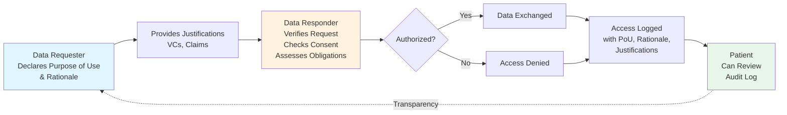

### 2.6. Laying the Foundation: Trust and Identity
For the access control loop described above to function reliably and securely, ExNex depends on robust, standardized mechanisms for establishing trust and verifying identity across a decentralized network of participants.

*   **The Need for Reliable Foundations:** Without a way to reliably know *who* is making a request, *who* is responding, and whether the *proofs* (justifications) presented are authentic, controlled data sharing is impossible.
*   **Key Enabling Technologies (to be detailed in Part 3):**
    *   **Verifying Entity Identity – OpenID Federation (OIDF):** ExNex proposes using the OpenID Federation 1.0 standard. This allows participants (Data Requesters, Data Responders, Service Providers) to cryptographically prove their identity and discover the capabilities and trustworthiness of other participants dynamically, without requiring pre-configured bilateral relationships between everyone.
    *   **Verifying Claims and Authorizations – Verifiable Credentials (VCs):** For many types of justifications (like proving a patient's identity to a high assurance level, or attesting to specific patient consent), ExNex uses Verifiable Credentials. These are digital, tamper-evident assertions issued by trusted entities.
    *   **Facilitating Key Functions – Narrow-Waist (NW) Service Providers:** To make the system scalable and ensure high quality for critical functions like strong identity proofing or consent management, ExNex relies on a small number of certified "Narrow-Waist" Service Providers. These entities act as trusted issuers of VCs and key OIDF participants.

These foundational technologies provide the secure and interoperable underpinnings necessary for the ExNex framework to operate effectively. The subsequent parts of this document will explore them in greater detail.

---

## Part 3: Building Trust and Defining Roles – The OIDF Framework in ExNex

This part details the foundational mechanisms ExNex uses to establish trust and define the roles and capabilities of participants. Central to this is the adoption of the OpenID Federation 1.0 (OIDF) standard, which enables a decentralized yet verifiable trust fabric. We also explore the specific ways ExNex entities are defined within this OIDF framework and the role of specialized Narrow-Waist (NW) Service Providers as key trust anchors and service enablers.

### 3.1. Deep Dive: OpenID Federation 1.0 (OIDF) in ExNex

In a decentralized network like ExNex, where many independent entities need to interact securely, establishing trust dynamically and scalably is paramount. ExNex adopts the **OpenID Federation 1.0 (OIDF)** specification as its foundational trust framework.

*   **Recap: OIDF for Dynamic, Scalable Trust:** OIDF allows for the creation of multilateral federations where trust can be established between entities without requiring direct, pre-existing relationships between all participants. It is mediated by trusted third parties (Trust Anchors).

*   **Key OIDF Concepts Used by ExNex:**
    *   **Entity:** Any participant in the ExNex Federation (e.g., a hospital, a patient's app, an NW Service Provider). Each has a distinct identity.
    *   **Entity Identifier:** A globally unique HTTPS URL that identifies an ExNex Entity (e.g., `https://hospital-a.exnex.org`).
    *   **Entity Statement:** A cryptographically signed JSON Web Token (JWT) containing information an Entity publishes about itself or a subordinate Entity.
        *   **Entity Configuration:** An Entity Statement an Entity issues *about itself*, found at `/.well-known/openid-federation` relative to its Entity Identifier. It contains its public Federation Entity Keys, metadata about its roles/capabilities, and hints about its superiors.
        *   **Subordinate Statement:** An Entity Statement issued by a Superior Entity (like a Trust Anchor or an Intermediate) *about one of its direct subordinates*, attesting to its membership and potentially applying policies.
    *   **Federation Entity Keys:** Public/private key pairs (published in an Entity Configuration) used by an Entity to sign its OIDF Entity Statements. These are distinct from keys used for application-level protocols (like signing data access requests).
    *   **Trust Anchor (TA):** An Entity representing the root of trust for the ExNex federation. Its public keys are securely distributed. The ExNex governing body or its designee would operate the TA(s).
    *   **Intermediate Entity:** An Entity that sits between a Trust Anchor and Leaf Entities (like individual apps or providers). NW Service Providers often act as Intermediates.
    *   **Trust Chain:** A verifiable sequence of Entity Statements linking a specific Entity back to a trusted Trust Anchor, proving its legitimate membership and attributes.
    *   **Federation Entity Discovery:** The process an Entity uses to collect Entity Statements to construct and validate a Trust Chain for another Entity.

*   **How OIDF Establishes Trust in ExNex:**
    1.  **Foundation:** All ExNex participants agree to trust one or more ExNex Trust Anchors.
    2.  **Entity Self-Assertion & Attestation:** Each Entity publishes its signed Entity Configuration. Superiors (TAs, Intermediates) issue signed Subordinate Statements about their subordinates.
    3.  **Dynamic Trust Resolution:** When a Data Responder receives a request from an unfamiliar Data Requester, it can perform Federation Entity Discovery to fetch the chain of Entity Statements linking the Requester back to a trusted TA. It verifies all signatures and claims in this Trust Chain. This provides assurance of the Requester's identity, its authentic public keys, and its trusted metadata (roles, capabilities).

*   **Benefits for ExNex:**
    *   **Scalability:** Avoids N² bilateral trust agreements.
    *   **Decentralization:** Entities manage their own keys and configurations, yet operate within a common trust framework.
    *   **Dynamic Discovery:** Entities can discover and verify each other on demand.
    *   **Policy Enforcement:** OIDF's `metadata_policy` allows Superiors to enforce rules on Subordinates (detailed in Section 3.3).
    *   **Security:** Cryptographic verification at each step ensures integrity and authenticity.

*   <diagram>A visual representation of an OIDF Trust Chain:
    Top Level: Box "ExNex Trust Anchor (TA)" with "TA Entity Configuration (Self-Signed by TA's Federation Key)".
    Arrow pointing down, labeled "Issues Subordinate Statement (Signed by TA)".
    Middle Level: Box "Intermediate Entity (e.g., NW Service Provider)" with "Intermediate Entity Configuration (Self-Signed by Intermediate's Federation Key)".
    Arrow pointing down from Intermediate, labeled "Issues Subordinate Statement (Signed by Intermediate)".
    Bottom Level: Box "Leaf Entity (e.g., Patient App / Hospital System)" with "Leaf Entity Configuration (Self-Signed by Leaf's Federation Key)".
    Caption: "An OIDF Trust Chain links a Leaf Entity back to a Trust Anchor through a verifiable sequence of signed Entity Statements. This allows dynamic verification of an entity's membership and attributes."
    </diagram>

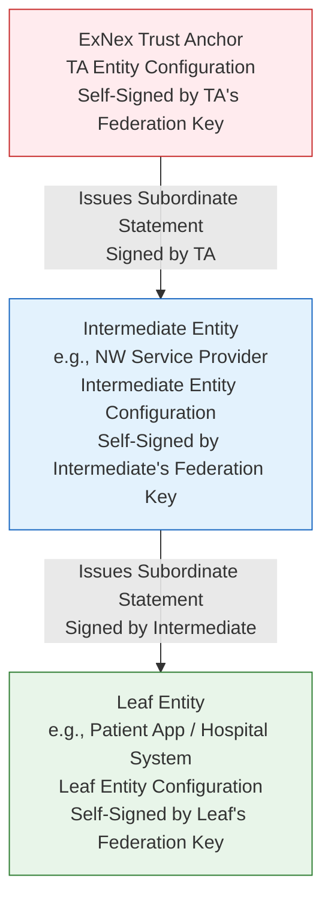

### 3.2. Defining Participants: ExNex OIDF Entity Types and Metadata

Every participant in ExNex is an OIDF Entity, publishing an Entity Configuration. This configuration includes standard OIDF claims (`iss`, `sub`, `jwks` for Federation Keys, `authority_hints`) and an ExNex-specific `metadata` object. This `metadata` object further contains claims under ExNex-defined Entity Type Identifiers, describing the roles and capabilities of the participant.

*   **Common OIDF Metadata for All ExNex Entities:** As listed above, essential for OIDF operations.

*   **ExNex-Specific OIDF Entity Type Identifiers & Key Metadata:**
    An Entity MAY declare multiple types if it performs multiple roles.
    *   **`federation_entity` (Standard OIDF Type):**
        *   Used by OIDF Superiors (Trust Anchors, Intermediates). Includes `organization_name`, `contacts`, `federation_fetch_endpoint` etc.
    *   **`exnex_data_requester`:** For entities that request health data (e.g., patient apps, provider EHR clients).
        *   **Key Metadata:**
            *   `display_name`: Human-readable name of the requester.
            *   `software_id`, `software_version` (Optional).
            *   `jwks` (or `signed_jwks_uri`): **Protocol Keys** used by this Requester to sign its Client Authentication JWTs and Authorization Assertion JWTs (distinct from its OIDF Federation Keys).
            *   `allowed_purposes_of_use`: List of `purpose_of_use` codes this Requester *claims* it supports (e.g., `["IndividualAccess", "Treatment"]`). Subject to policy.
            *   `allowed_justification_schemas`: List of justification schema identifiers this Requester *claims* it can use (e.g., `["exnex_pdc_vc_v1", "provider_treatment_relationship_v1"]`). Subject to policy.
            *   `token_endpoint_auth_methods_supported`: Client authentication methods it supports when acting as an OAuth client (e.g., `["private_key_jwt"]`).
            *   `token_endpoint_auth_signing_alg_values_supported`: Algorithms it uses for its client assertion JWTs.
    *   **`exnex_data_responder`:** For entities that hold and provide access to health data (e.g., hospital EHRs, lab systems). Acts as an OAuth 2.0 Authorization Server.
        *   **Key Metadata:**
            *   `display_name`: Human-readable name of the responder.
            *   `token_endpoint`: URL of its OAuth 2.0 token endpoint.
            *   `authorization_endpoint`: URL of its OAuth 2.0 authorization endpoint (if supporting 3-legged flows).
            *   `fhir_api_endpoint`: Base URL for its FHIR API (or other data API).
            *   `token_endpoint_auth_methods_supported`: Client authentication methods it supports *at* its token endpoint.
            *   `token_endpoint_auth_signing_alg_values_supported`: Algorithms it requires for client assertion JWTs sent *to* its token endpoint.
            *   `supported_purposes_of_use`: List of `purpose_of_use` codes this Responder is capable of and willing to support (e.g., `["IndividualAccess", "Treatment", "Emergency"]`).
            *   `supported_justification_schemas`: List of justification schema identifiers this Responder can process.
            *   `patient_audit_log_fhir_endpoint_suffix`: Relative path for patients to access their FHIR AuditEvent resources (e.g., `/AuditEvent?patient={patientId}`).
    *   **`exnex_trust_mark_issuer`:** For Narrow-Waist entities that issue Verifiable Credentials (which function as `justifications` or OIDF Trust Marks). Examples: NW-ID, NW-AUTH, NW-LIC, NW-PDC Service.
        *   **Key Metadata:**
            *   `display_name`: Name of the issuer (e.g., "ExNex NW Identity Service").
            *   `issued_credential_types`: List of VC schema identifiers it issues (e.g., `["ExNexIdentityCredential", "ExNexPatientDeveloperCredential"]`).
            *   `jwks` (or `signed_jwks_uri`): **Protocol Keys** used by this issuer to *sign the VCs* it issues (distinct from its OIDF Federation Keys).
            *   `revocation_list_uri_pattern`, `credential_status_endpoint` (For VC status checking).
    *   **`exnex_consent_management_service`:** For entities like NW-AUTH that manage patient consent preferences.
        *   **Key Metadata:**
            *   `display_name`: Name of the service (e.g., "ExNex NW Authorization & Consent Service").
            *   `opt_out_list_distribution_endpoint`: URL for Responders to fetch opt-out lists (e.g., Bloom filters).
            *   `consent_status_check_endpoint`: URL for Responders to make real-time consent status checks.
            *   `patient_consent_management_endpoint`: URL for patients/apps to manage consent preferences.

*   **Responsibilities Tied to OIDF Metadata:**
    *   **All Entities:** Maintain accurate Entity Configurations, secure Federation Keys, adhere to superior policies.
    *   **Data Requesters:** Accurately declare capabilities, secure protocol keys, construct valid Authorization Assertions.
    *   **Data Responders:** Publish correct endpoints, perform OIDF Trust Chain validation, process Authorization Assertions, integrate with consent services, provide patient audit logs.
    *   **NW Service Providers:** Securely manage VC signing keys, provide credential status and consent distribution mechanisms.

*   <diagram>A simple diagram showing an "ExNex Entity" box with its "Entity Identifier (URL)". An arrow points from the Entity Identifier to a "Well-Known URI (`/.well-known/openid-federation`)" which contains the "Entity Configuration (Signed JWT)". The Entity Configuration box shows key claims: `iss`, `sub`, `jwks` (Federation Keys), `authority_hints`, and a `metadata` object. The `metadata` object further expands to show example "ExNex Entity Type Identifiers" (e.g., `exnex_data_requester`, `exnex_data_responder`) and a few of their specific metadata parameters like `token_endpoint` or `allowed_purposes_of_use`.</diagram>

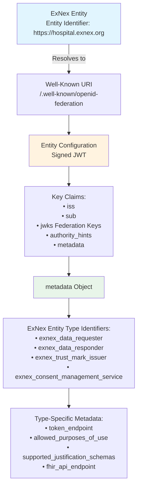


### 3.3. Enforcing Federation Rules: OIDF Policies in ExNex

OIDF's **Metadata Policy (`metadata_policy`)** and **`constraints`** features allow OIDF Superiors (ExNex Trust Anchors, Intermediates like NW Services) to define and enforce operational rules, security requirements, and behavioral expectations on their Subordinates. This ensures participants adhere to federation standards.

*   **The Role of `metadata_policy` and `constraints`:** To shape the declared capabilities and operational parameters of subordinate entities.
*   **How Policies Work:**
    *   **Location:** `metadata_policy` is in a Subordinate Statement issued by a Superior about a Subordinate.
    *   **Structure & Operators:** Mirrors the `metadata` structure, using operators like `value` (mandate specific value), `subset_of` (restrict to allowed values), `superset_of` (require certain values), `essential` (mark as mandatory).
    *   **Hierarchy and Merging:** Policies flow down the Trust Chain, generally becoming more restrictive.
    *   **Enforcement:** When a Data Responder resolves a Requester's Trust Chain, it applies all policies to the Requester's self-declared metadata. The resulting "resolved metadata" is what the Responder uses.
*   **Examples of Policies in ExNex:**
    *   **Trust Anchor Policy:** Might mandate all `exnex_data_responder` entities support certain signing algorithms for client authentication, or require all `exnex_data_requester` entities to only declare purposes from a master list.
    *   **Intermediate Policy (e.g., NW-PDC Service for PDC Apps):** Might restrict PDC apps to `allowed_purposes_of_use: ["IndividualAccess"]` and `allowed_justification_schemas: ["exnex_pdc_vc_v1"]`. Even if a PDC app tried to declare other capabilities, this policy would override it.
*   **Benefits for Federation Integrity:** Ensures consistency, manages risk, provides predictability, allows for evolvability of federation rules.

*   <diagram>A hierarchical diagram illustrating OIDF policy application:
    Top: "ExNex Trust Anchor" box, issues "Subordinate Statement for Intermediate (contains `metadata_policy_TA`)".
    Middle: "Intermediate Entity (e.g., NW-PDC Service)" box, receives policy from TA. It issues "Subordinate Statement for Leaf App (contains `metadata_policy_Intermediate`)".
    Bottom: "Leaf Entity (PDC App)" box, publishes its "Entity Configuration (with self-declared `metadata_Leaf`)".
    A note indicates: "A Data Responder resolving the Leaf App's trust chain applies both `metadata_policy_TA` and `metadata_policy_Intermediate` to `metadata_Leaf` to determine the app's effective, policy-enforced capabilities."
    </diagram>

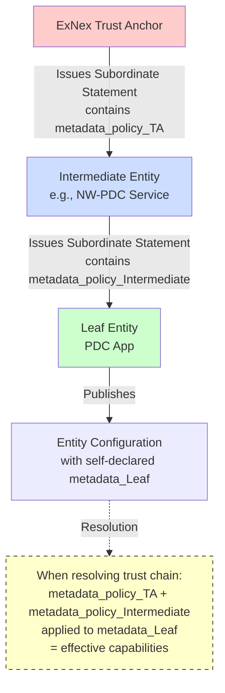

### 3.4. Pillars of Trust and Efficiency: Narrow-Waist (NW) Service Providers

To simplify participation and ensure high standards for critical functions, ExNex relies on a "Narrow-Waist (NW) Model" with specialized, certified service providers.

*   **The "Narrow-Waist" Concept and its Benefits:**
    *   Like an hourglass, NW providers are a standardized, trusted intermediary between many sources/users and many consumers.
    *   Reduces complexity from O(N²) to O(N) for trust and integration. Participants primarily trust and integrate with a few NW providers instead of countless individual entities.
    *   Ensures consistency and efficiency for specialized tasks.
*   **Key NW Service Providers in ExNex:**
    *   **NW-ID (Narrow-Waist Identity) Provider:** Offers NIST IAL2/AAL2 compliant identity verification. Issues high-assurance Identity VCs. Supports the identity proofing for Patient-Developer Credentials (PDCs).
    *   **NW-LIC (Narrow-Waist Licensure) Provider:** Aggregates and verifies healthcare provider licensure. Issues Healthcare License VCs.
    *   **NW-AUTH (Narrow-Waist Authorization) Service:** Manages patient consent preferences (opt-in/opt-out). Issues Authorization VCs attesting to patient consent. Distributes opt-out preferences (e.g., Bloom filters).
    *   **NW-PDC Service:** (May be part of NW-ID or distinct). Facilitates the process for individuals to register personal-use apps and obtain their patient-held PDC Verifiable Credential after identity proofing. **Important:** Anyone can register a PDC App with the federation. These apps are highly restricted vehicles that enable patient-developers to connect directly to the network. PDC Apps can *only* use PDCs as their justification – they cannot use other justification types. Other apps can also use PDCs, but PDC Apps are limited to PDCs only. This restriction ensures PDC Apps remain focused on patient self-access while benefiting from the trust established by the PDC itself.
*   **Their Role as OIDF Intermediates and Trusted Issuers of Verifiable Credentials:**
    *   **Certified Entities:** NW providers undergo audits to maintain their trusted status.
    *   **OIDF Intermediates:** They are typically OIDF Intermediate Entities, with their status attested by the ExNex Trust Anchor(s). They may, in turn, manage subordinate entities (e.g., NW-PDC Service managing OIDF entities for registered PDC apps).
    *   **Trusted VC Issuers:** Their primary role is issuing the Verifiable Credentials (Identity VCs, Authorization VCs, PDC VCs, License VCs) that serve as `justifications` in ExNex data access requests. Data Responders verify these VCs using the NW providers' OIDF-discovered public *protocol keys* (from `metadata.exnex_trust_mark_issuer.jwks`).
*   **Operational Note:** The specification and operational reliability of these NW services are critical. They will be subject to certification and ongoing oversight by the ExNex accreditation function (described in Part 6: Governance).

*   <diagram>Two contrasting diagrams, side-by-side:
    Diagram A ("Without NW Services - High Complexity"): Shows multiple "Leaf Entity" boxes (Apps, Hospitals) with many crisscrossing lines attempting to connect directly to multiple "Authoritative Sources/Functions" boxes (State Medical Boards, ID Proofing Services, Individual Consent Silos).
    Diagram B ("With ExNex NW Services - Simplified Trust"): Shows "Leaf Entity" boxes connecting primarily to a few "NW Service Provider" boxes (NW-ID, NW-LIC, NW-AUTH). The NW Service Providers, in turn, might interact with underlying authoritative sources or embody the authoritative function for the federation. Lines are much fewer, illustrating N complexity from the Leaf Entities' perspective. An hourglass shape can be overlaid on Diagram B, with Leaf Entities at the top wide part, NW Services at the narrow waist.
    Caption: "Narrow-Waist (NW) Service Providers simplify trust and integration by acting as certified intermediaries for critical functions."
    </diagram>

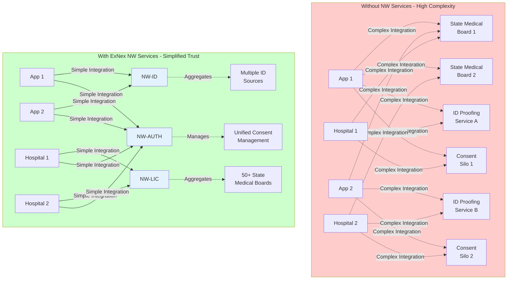

---

## Part 4: The Mechanics of Controlled Data Access

This part delves into the operational details of how ExNex controls data access. It revisits "Purpose of Use" and "Justifications" in more detail, explains the mechanisms for managing patient consent, and outlines the secure token flow used for requesting and granting access to data.

### 4.1. Defining "Why": Purposes of Use – In Detail

As introduced in Part 2, the **`purpose_of_use`** declared by a Data Requester is a cornerstone of ExNex's access control model. It dictates consent requirements, responder obligations, and the types of justifications needed.

*   **Recap:** The `purpose_of_use` provides essential context and triggers specific handling rules.

*   **The Spectrum of ExNex `purpose_of_use` Categories:**
    The following table outlines the primary purpose categories defined within ExNex, along with their default consent models and the Data Responder's obligation:

    | Purpose Category             | Consent Model              | Responder Obligation                 | Override Capability | Notes & Typical Justifications                                                                                                     |
    | :--------------------------- | :------------------------- | :----------------------------------- | :------------------ | :--------------------------------------------------------------------------------------------------------------------------------- |
    | **`IndividualAccess`**       | Explicit opt-in required\* | **Mandatory response**               | N/A                 | Patient accessing their own data. Justified by PDC VC, or NW Identity VC + NW Authorization VC.                                      |
    | **`Treatment`**                | Opt-out (default allowed)  | **Mandatory response**               | None                | Clinician accessing data for care. Justified by provider identity/license VCs, asserted relationship. Opt-out check required.        |
    | **`Emergency`**              | Opt-out (default allowed)  | **Mandatory response**               | Safety override     | Urgent access. Separate opt-out from `Treatment`. Heightened audit. Justifications similar to `Treatment` but flagged "Emergency". |
    | **`PaymentOperations`**      | Opt-out (default allowed)  | Optional - requires agreement        | None                | Payer functions (claims, eligibility). Justified by payer identity, asserted member relationship. Opt-out check required.         |
    | **`PublicHealth`**           | No consent required        | **Mandatory response**               | Opt-outs ignored    | Legally mandated reporting. Justified by requester identity and legal mandate reference.                                             |
    | **`Research`**                 | Explicit opt-in required   | Optional - requires agreement        | None                | Ethically approved studies. Justified by NW Identity VC + Research Consent VC.                                                     |
    | **`LegalDiscovery`**         | Explicit opt-in required   | Optional - requires agreement        | Court order         | Legal proceedings. Justified by patient consent or valid legal order.                                                              |
    | **`ExternalThirdParty`**     | Explicit opt-in required   | Optional - requires agreement        | None                | Other non-specified third-party access explicitly authorized by the patient. Justified by NW Identity VC + NW Authorization VC.    |

    *\*Note on `IndividualAccess`: The Patient-Developer Credential (PDC) VC inherently serves as the patient's explicit opt-in for accessing their own data. For other apps, an NW Authorization VC fulfills this.*

*   <diagram>A decision tree or flowchart for a Data Responder processing an incoming data access request.
    Start Node: "Receive Authorization Assertion JWT".
    1.  Decision Node: "Extract `purpose_of_use`". Branches for key purposes:
        *   Branch `IndividualAccess`: Process: "Verify PDC VC or (NW ID VC + NW AuthZ VC)". Result: "Mandatory Response if Valid".
        *   Branch `Treatment`: Process: "Verify Provider Justifications". Decision: "Check `Treatment` Opt-Out (e.g., Bloom Filter/API)". If No Opt-Out: "Mandatory Response". If Opted-Out: "Deny".
        *   Branch `Emergency`: Process: "Verify Provider Justifications". Decision: "Check `Emergency` Opt-Out". If No Opt-Out: "Mandatory Response". If Opted-Out: Check "Safety Override Policy?". If Override: "Mandatory Response (Heightened Audit)". Else: "Deny".
        *   Branch `PublicHealth`: Process: "Verify Requester & Mandate". Result: "Mandatory Response (No Consent Check)".
        *   Branch `PaymentOperations` / `Research` / `Legal` / `ExternalThirdParty`: Process: "Verify Justifications (incl. Opt-In VCs if needed)". Decision: "Check for Prior Agreement with Requester?". If Agreement Exists (and consent valid): "Optional Response (Responder Decides)". Else: "Deny (No Agreement or Invalid Consent)".
    End Nodes: "Grant Access (Scoped)" or "Deny Access (Log Reason)".
    </diagram>

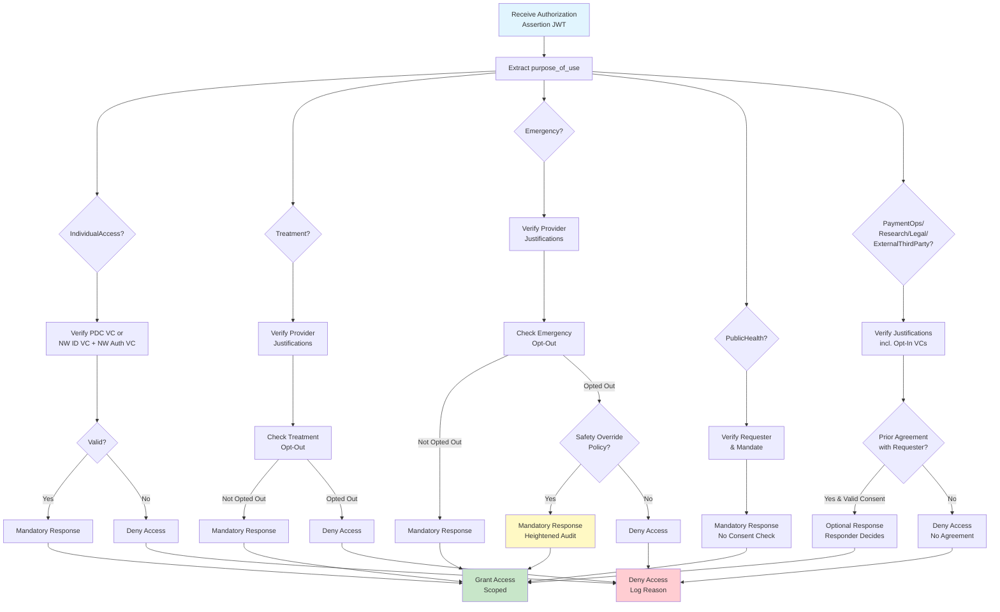

### 4.2. Honoring Patient Choice: Consent Management and Privacy

ExNex integrates robust mechanisms for managing patient consent (both opt-in and opt-out) and distributing opt-out preferences in a privacy-preserving manner, primarily orchestrated by the **NW-AUTH Service**.

*   **The Role of NW-AUTH in Consent Orchestration:**
    *   **Recording Patient Consent Preferences:** NW-AUTH provides interfaces (or supports federated interfaces) for patients to manage their opt-in choices (e.g., for `Research`, or authorizing a specific third-party app under `ExternalThirdParty` or `IndividualAccess`) and their opt-out choices (e.g., for `Treatment` or `Emergency`).
    *   **Issuing Authorization Credentials:** For opt-in scenarios, NW-AUTH (or an equivalent trusted authority like an IRB for research consent) issues Verifiable Credentials (e.g., `exnex_nw_auth_vc_v1`, `exnex_research_consent_vc_v1`). These VCs attest to the patient's explicit consent for a specific Data Requester and scope.
    *   **Distributing Opt-Out Directives:** For purposes allowing opt-out, NW-AUTH publishes these preferences for Data Responders to consume.

*   **Opt-In Mechanisms: Explicit Permission Required:**
    *   For purposes like `Research`, `LegalDiscovery`, `ExternalThirdParty`, and for non-PDC `IndividualAccess`, the patient must explicitly opt-in.
    *   This is typically attested by an Authorization VC (e.g., `exnex_nw_auth_vc_v1`) presented by the Data Requester, linking the patient (via their Identity VC) to the authorized Requester and the scope of consent.

*   **Privacy-Preserving Opt-Out Distribution:**
    For purposes where access is allowed by default unless a patient opts out (e.g., `Treatment`, `Emergency`), ExNex uses a privacy-preserving mechanism:
    1.  **Periodic Bloom Filter Publication by NW-AUTH:**
        *   NW-AUTH periodically (e.g., daily) publishes **full Bloom filters** for each purpose category that supports opt-out (e.g., one filter for "Treatment Opt-Outs," another for "Emergency Opt-Outs").
        *   These filters contain **hashed combinations of patient demographics** (e.g., Last name + DOB; Phone; Last name + ZIP + DOB) for opted-out patients. Multiple demographic hashes per patient support various query patterns.
        *   Bloom filters probabilistically indicate if an item *might be* in a set or *definitely is not*, with a small, configurable false positive rate (e.g., 1%) but no false negatives. This means filter sizes can remain small and manageable.
    2.  **Responder Action: Checking Local Filters:**
        *   Data Responders download these Bloom filters from NW-AUTH's `opt_out_list_distribution_endpoint` (discovered via OIDF).
        *   Before releasing data for an opt-outable purpose, the Responder hashes the demographics of the patient in the request and checks these hashes against its local copy of the relevant Bloom filter.
        *   If the filter shows "no match," the patient has definitively not opted out.
        *   If the filter indicates a "possible match" (could be a true opt-out or a rare false positive), the Responder should then use the Opt-Out Verification API for a definitive check.
    3.  **Opt-Out Verification API (for Confirmation):**
        *   NW-AUTH provides a `consent_status_check_endpoint` (discovered via OIDF).
        *   Responders can query this API with either hashed demographics or, for higher assurance, the patient's full Identity VC.
        *   The API returns a definitive `{"opted_out": true|false}` status.

*   **Granularity and Core Consent Principles:**
    *   **Granularity:** Patients can make separate opt-in/opt-out decisions for different purpose categories.
    *   **Durability & Portability:** Opt-outs remain effective until explicitly revoked by the patient and are intended to be recognized federation-wide.
    *   **Transparency:** All access attempts, including those blocked by consent, are logged.
    *   **Edge Enforcement:** Consent checking (using downloaded filters or API calls to NW-AUTH) happens at the Data Responder's edge.
*   **User Experience Note:** While ExNex defines the mechanisms, certified NW-AUTH providers will be responsible for developing user-friendly interfaces and workflows for patients to manage their consent preferences. The aim is a small number of excellent, consistent experiences rather than widespread inconsistent implementations.

*   **Consent Synchronization Requirements:**
    *   **Bloom Filter Update Frequency:** NW-AUTH must publish updated Bloom filters daily (at minimum). Files should be versioned and support bucket-based hosting (e.g., S3, Azure Blob) for efficient distribution.
    *   **Maximum Opt-Out Propagation Lag:** 6 hours. This means from the time a patient opts out, all Data Responders must have access to updated filters reflecting this change within 6 hours.
    *   **Filter Download Requirements:** Data Responders must check for and download updated filters at least every 4 hours to ensure they meet the 6-hour propagation requirement.
    *   **TODO: Failover Procedures:** *Define procedures for handling NW-AUTH service unavailability, including:*
        - *Fallback to last known good filter state*
        - *Grace period policies*
        - *Manual override mechanisms for critical situations*

*   <diagram>Two-part diagram for Opt-Out Distribution:
    Part A ("Bloom Filter Creation & Distribution"):
    1. Box "Patient" with arrow "Opts-Out (for Treatment)" to Box "NW-AUTH Service".
    2. Inside "NW-AUTH Service": Text "Hashes Patient Demographics (e.g., 'Smith,19800101' -> hash1; '5551234' -> hash2)". Arrow to "Adds Hashes to 'Treatment Opt-Out Bloom Filter' (visualize bit array)".
    3. Arrow from "NW-AUTH Service" labeled "Publishes Daily Bloom Filter Snapshot" to multiple "Data Responder" boxes that "Download Filter".
    Part B ("Responder Checking Filter"):
    1. Box "Data Requester" sends "Request for Patient X (Treatment purpose)" to Box "Data Responder".
    2. Inside "Data Responder": Text "Hashes Patient X's Demographics (same method as NW-AUTH)". Arrow to "Checks Hashes against Local 'Treatment Opt-Out Bloom Filter'".
    3. Two outcomes: Arrow to "Outcome 1: No Match -> Patient has NOT opted out. Proceed." Arrow to "Outcome 2: Possible Match -> Trigger Opt-Out Verification API call to NW-AUTH for definitive check."
    </diagram>

```mermaid
flowchart TB
    subgraph PartA[Part A: Bloom Filter Creation & Distribution]
        Patient[Patient] -->|Opts-Out<br/>for Treatment| NWAUTH[NW-AUTH Service]
        
        NWAUTH --> HashDemo["Hashes Patient Demographics<br/>e.g., 'Smith,19800101' → hash1<br/>'5551234' → hash2"]
        HashDemo --> AddFilter["Adds Hashes to<br/>'Treatment Opt-Out Bloom Filter'<br/>[01101001...]"]
        
        AddFilter -->|Publishes Daily<br/>Bloom Filter Snapshot| Resp1[Data Responder 1]
        AddFilter -->|Publishes Daily<br/>Bloom Filter Snapshot| Resp2[Data Responder 2]
        AddFilter -->|Publishes Daily<br/>Bloom Filter Snapshot| Resp3[Data Responder 3]
        
        Resp1 -->|Downloads Filter| Local1[Local Copy]
        Resp2 -->|Downloads Filter| Local2[Local Copy]
        Resp3 -->|Downloads Filter| Local3[Local Copy]
    end
    
    subgraph PartB[Part B: Responder Checking Filter]
        Requester[Data Requester] -->|Request for Patient X<br/>Treatment purpose| Responder[Data Responder]
        
        Responder --> HashPatient["Hashes Patient X's Demographics<br/>(same method as NW-AUTH)"]
        HashPatient --> CheckFilter["Checks Hashes against<br/>Local 'Treatment Opt-Out<br/>Bloom Filter'"]
        
        CheckFilter --> NoMatch["Outcome 1: No Match<br/>Patient has NOT opted out<br/>Proceed"]
        CheckFilter --> PossibleMatch["Outcome 2: Possible Match<br/>Trigger Opt-Out Verification<br/>API call to NW-AUTH<br/>for definitive check"]
    end
    
    style NWAUTH fill:#e3f2fd
    style AddFilter fill:#fff3e0
    style NoMatch fill:#c8e6c9
    style PossibleMatch fill:#fff9c4
```

### 4.3. Proving the Right: Justifications – In Detail

Justifications are the verifiable attestations presented by a Data Requester to support their access request for a given `purpose_of_use`. They are included in the Authorization Assertion JWT.

*   **Recap:** Justifications link the request to the Requester's identity, patient identity (if applicable), patient consent, and/or relevant relationships or legal mandates.

*   **Verifiable Credentials (VCs) as Justifications:**
    VCs are cryptographically signed, tamper-evident digital assertions issued by trusted ExNex entities (typically NW Service Providers, whose trustworthiness and VC signing keys are discoverable via OIDF).
    *   **NW Identity Credential VC (Schema `nw_id_vc_v1`):**
        *   **Purpose:** Provides high-assurance (NIST IAL2) cryptographic proof of a patient's identity, including verified demographic attributes.
        *   **Issuer:** Trusted ExNex NW-ID Service.
        *   **Usage:** Essential for accurate patient matching by Responders; often presented alongside an Authorization VC to link consent to a strongly verified identity.
    *   **NW Authorization Credential VC (Schema `exnex_nw_auth_vc_v1`):**
        *   **Purpose:** Attests that a specific patient (identified by their `sub`, matching an Identity VC) has granted consent to a specific Data Requester (identified by `aud`) for a defined scope of access (e.g., specific data elements, timeframes).
        *   **Issuer:** Trusted ExNex NW-AUTH Service (or equivalent consent authority).
        *   **Usage:** Presented by an app (e.g., an IAS app) to prove it has explicit patient consent.
    *   **NW Patient-Developer Credential (PDC) VC (Schema `exnex_pdc_vc_v1`):**
        *   **Purpose:** Enables an individual (patient) to access their *own* health data for `purpose_of_use: IndividualAccess`. Combines strong identity proofing with broad self-access rights.
        *   **Issuer:** Trusted ExNex NW-ID Service or a dedicated NW-PDC Service.
        *   **Usage:** Presented by a PDC-enabled app. The Responder uses verified demographics for matching and honors the broad permissions for self-access.
    *   **Other Potential VCs:**
        *   `exnex_research_consent_vc_v1`: Similar to `exnex_nw_auth_vc_v1` but specific to research, potentially referencing IRB approval and specific research data use constraints. Issuer: NW-AUTH or recognized Research Consent Authority.
        *   `exnex_healthcare_license_vc_v1`: Proves a clinician's current licensure and specialty. Issuer: NW-LIC Service. Used as part of `Treatment` or `Emergency` justifications.

*   **Direct Claim Justifications by the Requester:**
    In certain scenarios, particularly for established organizational relationships where the Requester's OIDF identity is already strongly verified, the justification may involve direct claims made by the Data Requester within the Authorization Assertion. Trust in these claims is derived from the Requester's OIDF-verified status and adherence to ExNex policies.
    *   **Provider Relationship (Schema `provider_treatment_relationship_v1`):**
        *   Asserted by a healthcare Provider (Data Requester) for `purpose_of_use: Treatment`, claiming an active treatment relationship with the patient. Includes patient identifiers and demographics for matching.
    *   **Payer Relationship for Treatment/Care Coordination (Schema `beneficiary_treatment_relationship_v1`):**
        *   Asserted by a Payer (Data Requester) for `purpose_of_use: Treatment` (e.g., for care gap closure programs). Includes beneficiary identifiers, demographics, and attestation of the specific program/need.
    *   **Payer Relationship for Payment Operations (Schema `beneficiary_payment_relationship_v1`):**
        *   Asserted by a Payer for `purpose_of_use: PaymentOperations`. Includes beneficiary identifiers and attestation of active coverage.
    *   **Payer Attributed Member Cohort (Schema `payer_attributed_member_cohort_v1`):**
        *   Asserted by a Payer for accessing data for a *group* of its attributed members from a specific provider, typically for `purpose_of_use: PaymentOperations` (e.g., quality reporting tied to payment) or `PopulationHealthManagement`. References the underlying Data Sharing Agreement.

*   **Combining Justifications:** A single Authorization Assertion JWT may contain an array of multiple justification objects if needed to fully authorize the request (e.g., an Identity VC + an Authorization VC).

*   <diagram>A conceptual diagram showing an "Authorization Assertion JWT" box. Inside, it lists key claims: `iss`, `aud`, `purpose_of_use`, `rationale`. A prominent section shows `justifications: [ ... ]`. Inside the array, illustrate two example justification objects:
    1.  Object 1: `type: "exnex_pdc_vc_v1"`, `credential: { <PDC VC JWT data structure icon> }`. An arrow points from this VC back to an "NW-ID/PDC Service (Issuer)" box.
    2.  Object 2: `type: "provider_treatment_relationship_v1"`, `patient: { ... }`, `provider: { ... }`, `relationship_context: "..."`.
    Caption: "The `justifications` array carries the verifiable proof (VCs or direct claims) supporting the access request."
    </diagram>

```mermaid
flowchart TB
    JWT[Authorization Assertion JWT]
    
    JWT --> Claims[Key Claims:<br/>• iss<br/>• aud<br/>• purpose_of_use<br/>• rationale]
    
    JWT --> Just[justifications: array]
    
    Just --> Obj1[Object 1:<br/>type: exnex_pdc_vc_v1<br/>credential: PDC VC JWT]
    Just --> Obj2[Object 2:<br/>type: provider_treatment_relationship_v1<br/>patient: {...}<br/>provider: {...}<br/>relationship_context: ...]
    
    NWID[NW-ID/PDC Service<br/>Issuer] -.->|Issues| Obj1
    
    style JWT fill:#e1f5fe,stroke:#0277bd,stroke-width:3px
    style Just fill:#fff3e0,stroke:#f57c00,stroke-width:2px
    style NWID fill:#e8f5e9,stroke:#2e7d32
    
    classDef justification fill:#f3e5f5,stroke:#7b1fa2
    class Obj1,Obj2 justification
```

### 4.4. The Secure Handshake: ExNex Authorization Token Flow

ExNex uses an OAuth 2.0-based token flow to enable Data Requesters (clients) to securely obtain access tokens from Data Responders (Authorization Servers). This flow ensures only authenticated and authorized Requesters gain access, and supports "Automatic Registration" where a Responder can establish trust with a new Requester dynamically based on its verifiable OIDF federation membership.

*   **Overview:** The Requester presents two JWTs to the Responder's token endpoint: a Client Authentication JWT and an Authorization Assertion JWT.

*   **The Token Request to the Responder:**
    *   An HTTPS POST request to the Data Responder's `token_endpoint`.
    *   Body includes:
        *   `grant_type: urn:ietf:params:oauth:grant-type:jwt-bearer`
        *   `client_assertion_type: urn:ietf:params:oauth:client-assertion-type:jwt-bearer`
        *   `client_assertion`: The **Client Authentication JWT**.
        *   `assertion`: The **Authorization Assertion JWT**.

*   **The Client Authentication JWT:**
    *   **Purpose:**
        1.  Authenticates the client application (Data Requester) to the token endpoint.
        2.  Provides the Responder with the Requester's OIDF Entity Identifier (which acts as its `client_id`).
        3.  **Enables Automatic Registration:** The Requester includes its OIDF **`trust_chain`** (the sequence of OIDF Entity Statements linking it to a trusted ExNex Trust Anchor) directly within this JWT. This allows the Responder to immediately verify the Requester's federation membership and retrieve its trusted metadata (including its protocol keys) without prior manual configuration.
    *   **Key Payload Claims:** `iss` (Requester's OIDF Entity ID), `sub` (same as `iss`), `aud` (Responder's Entity ID or token endpoint URL), `jti` (unique JWT ID), `exp` (short-lived expiration), `trust_chain` (array of OIDF Entity Statement JWTs).
    *   **Signature:** Signed using the Data Requester's **protocol key** (published in `metadata.exnex_data_requester.jwks` within its OIDF Entity Configuration, which is part of the `trust_chain`). This key is distinct from its OIDF Federation Key.

*   **The Authorization Assertion JWT:**
    *   **Purpose:** This is the core payload where the Requester details *what* it wants to do (`purpose_of_use`), *why* (`rationale`), and *with what proof* (`justifications`).
    *   **Key Payload Claims:** `iss` (Requester's OIDF Entity ID), `sub` (same as `iss`), `aud` (Responder's Entity ID), `jti`, `exp`, `purpose_of_use`, `rationale`, `justifications` (array of justification objects as detailed in Section 4.3).
    *   **Signature:** Also signed using the Data Requester's **protocol key**.

*   **Simplified Responder Processing Steps:**
    1.  **Authenticate Client & Establish Trust (Automatic Registration):**
        *   Parse the `client_assertion` (Client Authentication JWT).
        *   Extract and validate the embedded `trust_chain` (verify all OIDF Entity Statement signatures up to a known ExNex Trust Anchor, apply any `metadata_policy` from the chain).
        *   From the verified `trust_chain`, obtain the Requester's authentic OIDF Entity Configuration and its "resolved effective metadata" (including its protocol keys for signing these JWTs and its permitted capabilities).
        *   Verify the signature of the `client_assertion` JWT itself using the appropriate protocol key from the Requester's resolved metadata.
    2.  **Process Authorization:**
        *   Verify the `assertion` (Authorization Assertion JWT) signature using the Requester's protocol key.
        *   Validate all claims in the Authorization Assertion JWT (`aud`, `purpose_of_use` against resolved capabilities, etc.).
        *   Process each justification in the `justifications` array (e.g., verify signatures of any VCs using the VC issuer's OIDF-discovered protocol keys, evaluate direct claims against policy).
        *   Perform consent checks (e.g., consult local Bloom filters or NW-AUTH API for opt-outs relevant to the `purpose_of_use`).
        *   Apply any other internal policies.
    3.  **Issue Token:** If all verifications and policy checks pass, issue an OAuth 2.0 access token, scoped appropriately (e.g., to the specific patient if applicable, and to the permissions granted by consent/purpose).

*   <diagram>A sequence diagram illustrating the ExNex Token Flow:
    Actor 1: "Data Requester (Client)". Actor 2: "Data Responder (Token Endpoint)".
    1.  Data Requester -> Data Responder: HTTPS POST Request to Token Endpoint.
        *   Body includes: `grant_type`, `client_assertion_type`, `client_assertion (JWT with trust_chain)`, `assertion (AuthZ JWT with PoU, rationale, justifications)`.
    2.  Data Responder (Internal Processing):
        *   Step A: "Authenticate Client":
            *   "Parse `client_assertion`".
            *   "Validate `trust_chain` (verify OIDF signatures to Trust Anchor, apply policies)".
            *   "Obtain Requester's resolved OIDF metadata (incl. protocol keys)".
            *   "Verify `client_assertion` signature".
        *   Step B: "Process Authorization":
            *   "Parse `assertion` (Authorization Assertion JWT)".
            *   "Verify `assertion` signature".
            *   "Validate claims (`aud`, `purpose_of_use` vs. resolved capabilities)".
            *   "Process `justifications` (verify VCs, evaluate direct claims)".
            *   "Perform Consent Checks (opt-out filters/API)".
            *   "Apply internal policies".
    3.  Data Responder -> Data Requester: HTTPS Response.
        *   If successful: `{ "access_token": "...", "token_type": "Bearer", ... }`.
        *   If failed: OAuth 2.0 error response.
    </diagram>

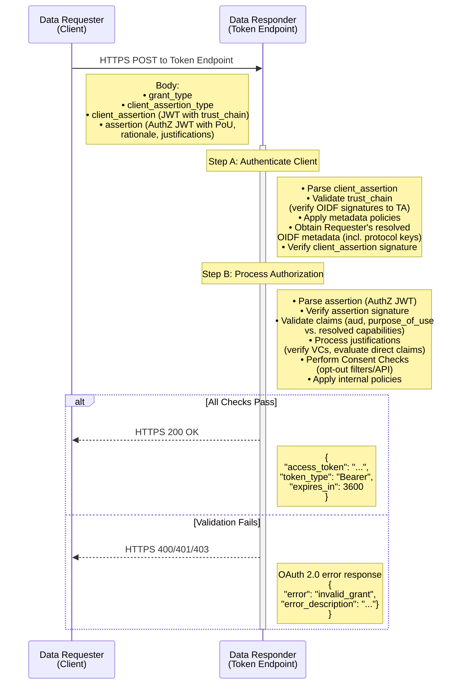

---

    
    ## Part 5: Key Programs and Operational Framework

This part highlights specific programs and operational aspects that are central to ExNex's functionality and goals. It details the Patient-Developer Credential (PDC) program for individual empowerment, discusses how data is discovered and retrieved using different network access patterns, outlines the economic model for sustainability, and emphasizes the critical role of auditability and transparency.

### 5.1. True Patient Empowerment: The Patient-Developer Credential (PDC) Program

A flagship initiative of the ExNex Federation is the **Patient-Developer Credential (PDC) Program**. This program is designed to provide individuals with direct, programmatic, and low-friction access to their *own* health data across the entire federation, using applications they control or even develop themselves.

*   **Vision: Removing Barriers, Promoting Innovation, Ensuring Patient Control for Self-Access:**
    The PDC program aims to overcome traditional hurdles patients face in obtaining their complete health data in a computable format. It empowers them to:
    *   Use a diverse ecosystem of personal health tools and applications.
    *   Aggregate and manage their health information from multiple sources.
    *   Remain directly in control of how their PDC-enabled app accesses their data, using a patient-held credential.

*   **PDC Onboarding Flow:**
    Individuals typically obtain a PDC Verifiable Credential through a process facilitated by an **NW-PDC Onboarding Service** (which could be part of an NW-ID provider or a distinct NW entity):
    1.  **High-Assurance Identity Proofing:** The individual undergoes identity verification meeting **NIST IAL2 (Identity Assurance Level 2)** standards, performed by a certified ExNex NW-ID provider. (A one-time fee for this identity proofing may apply, as per the economic model).
    2.  **(Optional) Personal App Registration:** For individuals developing or configuring a specific app for their personal use, the NW-PDC Onboarding Service may provide a UX to register the app. This can result in the creation of a new OIDF Federation Entity for that app instance, with OIDF policies applied by the NW-PDC Service (e.g., restricting it to `purpose_of_use: IndividualAccess`).
    3.  **Issuance of the PDC Verifiable Credential:** Upon successful IAL2 identity proofing, the authorized NW entity (e.g., NW-ID or the NW-PDC Service) issues the **PDC Verifiable Credential (VC)** (schema `exnex_pdc_vc_v1`) directly to the patient. This is a **patient-held assertion**.

*   **Characteristics of the PDC Verifiable Credential (`exnex_pdc_vc_v1`):**
    *   **Cryptographically Bound to Patient's Identity:** Securely linked to the individual's IAL2-verified identity.
    *   **Patient-Held:** The patient controls this credential (e.g., stores it in a digital wallet or provides it to their chosen app).
    *   **Explicitly Scoped for "Self-Access Only":** Its sole `purpose_of_use` is `IndividualAccess` for the data belonging to the credential holder.
    *   **Contains Verified Demographics:** Includes the patient's IAL2-verified demographics within its `credentialSubject` for accurate matching by Data Responders.
    *   **Broad Permissions (for Self-Access):** Typically grants broad access permissions (e.g., undefined or null `event_date_range` and `source_data_jurisdictions` within its `credentialSubject.granted_permissions.constraints`), signifying "all available data for this individual from this responder."

*   **Access Rights for PDC Holders:**
    When an application presents a valid PDC VC as justification for `purpose_of_use: IndividualAccess`:
    *   **RLS Access:** Full access to Record Locator Services to find all locations of their own records.
    *   **Direct Edge API Access:** Ability to query any participating Data Responder directly for their own data.
    *   **Automatic Patient Matching:** Responders use the trusted, verified demographics in the PDC VC for high-accuracy matching.
    *   **No Opt-Out Check Required (for Self):** The PDC VC itself *is* the explicit, standing opt-in from the patient for accessing their own data.
    *   **Simplified Justification:** The single PDC VC is sufficient justification for `IndividualAccess`.

*   **Economic Advantage: Zero Data Access Fees for PDC Use:**
    As detailed in the economic model (Section 5.3), patients using a PDC VC to access their own data are **not charged any fees** by Data Responders or Networks for this access.

*   <diagram>A flowchart for the Patient-Developer Credential (PDC) Onboarding Process:
    1.  Start: "Patient Initiates PDC Process" (arrow to Step 2).
    2.  Box: "NW-PDC Onboarding Service (or NW-ID Service)" (arrow to Step 3).
    3.  Box: "IAL2 Identity Proofing (via NW-ID)" (arrow to decision "Successful?").
        *   If No: End.
        *   If Yes: Arrow to Step 4.
    4.  Box (Optional, dashed border): "Patient Registers/Onboards Personal App with NW-PDC Service" (This step might result in an OIDF Entity for the app, managed by the NW-PDC Service). (Arrow to Step 5).
    5.  Box: "Authorized NW Entity (NW-ID or NW-PDC Service) Issues PDC Verifiable Credential (`exnex_pdc_vc_v1`) to Patient". (Arrow to Step 6).
    6.  End: "Patient Holds PDC VC for Self-Access via Approved/Personal Apps".
    </diagram>

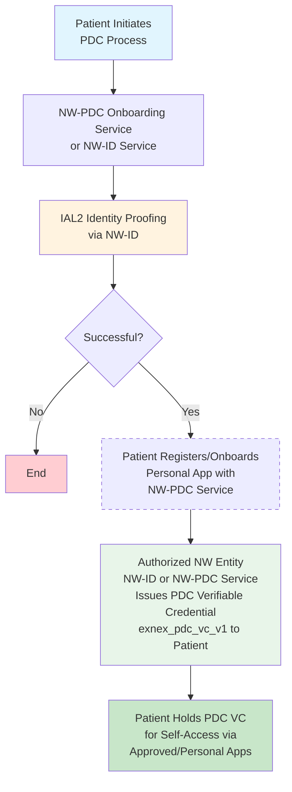

### 5.2. Finding and Fetching: Network Access Patterns

ExNex supports flexibility in how Data Requesters discover and retrieve data, offering two complementary patterns that operate under the same unified trust fabric.

*   **Network-Mediated Access via Record Locator Services (RLS):**
    *   **Role of Networks:** Existing Health Information Exchanges (HIEs), QHIN-like entities, or new ExNex-specific networks can act as OIDF Entities providing RLS. They help Requesters discover *where* a patient's data might reside across participating Data Responders.
    *   **RLS Query (Sketch):** A Data Requester sends a query to a Network's RLS endpoint. This query is typically a simple, standardized FHIR-based operation. For example:
        `GET /Patient/$exnex-find-records?patientIdentityToken=<JWT_compact_form_of_PDC_or_ID_VC>&purposeOfUse=Treatment`
        *   The `patientIdentityToken` parameter follows the same justification format as used in other ExNex requests. It's a compact-serialized JWT containing the patient's verifiable credential (PDC VC or Identity VC). The RLS extracts the verified demographics from this VC to perform patient matching across its index. This ensures consistent, high-assurance identity verification throughout the federation.
        *   The `purposeOfUse` parameter is essential for the RLS to understand the context, though the RLS itself doesn't enforce consent for data retrieval (that's the Responder's job).
    *   **RLS Response:** The RLS searches its index and returns:
        *   A list of Data Responder OIDF Entity Identifiers (or their FHIR service root URLs) that likely hold data for the patient.
        *   Optionally, if known by the RLS and permissible to share, it *may* also return endpoint-specific patient identifiers for the matched patient at those responder locations. This can simplify subsequent direct queries.
        *   **Crucially, the RLS does NOT retrieve or cache the actual clinical data itself.** It only provides pointers.
    *   **Usage:** Best when the Requester doesn't know all potential locations of a patient's data or needs broad discovery.

*   **Direct Edge Access:**
    *   **How it Works:** The Data Requester communicates directly with the API endpoint of a known Data Responder.
        1.  The Requester initiates the full **ExNex Authorization Token Flow** (as detailed in Section 4.4) directly with the Responder's token endpoint.
        2.  If the request pertains to a specific patient, the Responder matches the patient using the provided justifications (e.g., demographics from an Identity VC or PDC VC).
        3.  The access token issued by the Responder for patient-specific data will be bound to that patient's internal identifier within the Responder's system. This patient context might be implicitly part of the token or explicitly returned to the Requester.
        4.  The Requester then uses this patient-bound access token to make specific data requests (e.g., FHIR API calls) to the Responder's data endpoint.
    *   **Usage:** Used after an RLS has provided location pointers, or for routine exchanges between established partners where the data source is already known.

*   **The Unified Trust Fabric:**
    It is vital to understand that both RLS-mediated discovery and Direct Edge Access for data retrieval operate under the same ExNex trust fabric:
    *   Same OIDF mechanisms for entity verification.
    *   Same ExNex Authorization Token Flow for actual data access from Responders.
    *   Same Verifiable Credential schemas and justification patterns.
    *   Same consent checking mechanisms applied by Data Responders.
    *   Same audit requirements for Data Responders.

*   <diagram>A diagram contrasting RLS-mediated discovery followed by Direct Edge access versus Direct Edge access alone.
    Panel 1: "RLS-Mediated Discovery + Direct Edge Access"
    1. "Data Requester" sends "RLS Query (Patient ID Token, PoU)" to "Network RLS Provider (ExNex Entity)".
    2. "Network RLS Provider" queries its "Internal Index" and returns "List of Responder Endpoints (e.g., URL for Responder A, URL for Responder B) [+ Optional Patient IDs at Responders]".
    3. "Data Requester" then performs "Direct Edge Access (Token Flow + FHIR Request as in Panel 2)" sequentially to "Responder A", then "Responder B", etc.
    Panel 2: "Direct Edge Access Only"
    1. "Data Requester" (already knowing Responder's endpoint) sends "Token Request (Client Auth JWT + AuthZ Assertion JWT)" directly to "Data Responder X".
    2. "Data Responder X" (if valid) issues "Access Token (Patient-Bound)".
    3. "Data Requester" sends "FHIR Data Request (using token)" to "Data Responder X".
    4. "Data Responder X" returns "FHIR Data Response".
    Caption: "ExNex supports both RLS for discovery and Direct Edge access for data retrieval, all under a unified trust framework."
    </diagram>

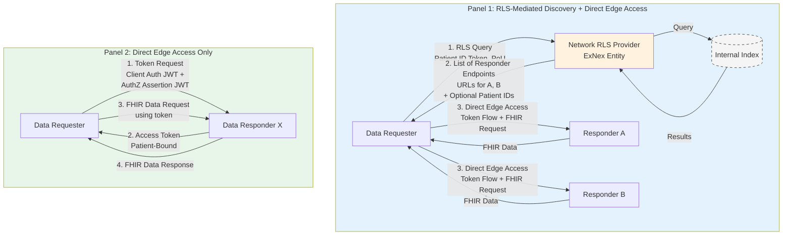

### 5.3. Sustainable Operations: The ExNex Economic Model

A sustainable economic model is crucial for the long-term viability and widespread adoption of ExNex. The model is designed to ensure essential data flows freely while allowing for value-based arrangements for other services.

*   **Core Principle: Self-Provisioned Capacity:**
    *   Each participating organization (Data Responders like hospitals, clinics, labs; Data Requesters like provider systems, payer platforms) is responsible for funding and operating its own infrastructure to meet its ExNex obligations.
    *   This includes capacity for: responding to inbound queries for mandatory purposes, maintaining required uptime, storing audit logs, synchronizing opt-out filters, and supporting both RLS-referred and direct edge queries.
    *   The cost of supporting mandatory exchanges is treated as a normal operational IT expense, scaling naturally with the size of an organization's patient population or membership.

*   **Fee Structure:**
    *   **Within Networks (for RLS and other Network-provided services):**
        *   Networks offering RLS or other value-added services to their members *may* charge their own participating members reasonable membership fees or infrastructure support fees.
        *   These fees are determined by each network's governance and cover the cost of the services the network provides to its community.
        *   **Importantly, Networks do not charge Requesters or other Networks on a per-RLS query basis for RLS lookups.** RLS access is a benefit of network participation or, for PDC users accessing their own data, often free.
    *   **Between Participants (Requesters & Responders) for Data Retrieval:**
        *   **For MANDATORY Response Purposes** (as defined in Section 4.1: `IndividualAccess`, `Treatment`, `Emergency`, `PublicHealth`):
            *   **NO FEES ALLOWED:** Data Responders **cannot** charge Data Requesters for retrieving data for these purposes.
            *   Responders **cannot** refuse valid, authorized queries for these purposes (unless a patient has validly opted out where applicable, or a technical issue prevents response).
            *   No bilateral fee arrangements are permitted for these mandatory exchanges.
        *   **For OPTIONAL Response Purposes** (as defined in Section 4.1: `Research`, `PaymentOperations` beyond basic claims, `LegalDiscovery`, `ExternalThirdParty`):
            *   Data Responders *may decline* to participate or respond to queries for these purposes unless a prior agreement is in place with the Data Requester.
            *   These agreements *may* include terms for cost-sharing, subscription fees, or other financial arrangements, negotiated directly between the parties.
    *   **Patient-Developer Credential (PDC) Access:**
        *   **ZERO DATA ACCESS FEES:** To maximize patient empowerment, individuals using a PDC VC to access *their own data* for `purpose_of_use: IndividualAccess` face:
            *   No network membership fees for RLS access related to locating their own data.
            *   No data access fees from Data Responders.
        *   **Exception – ID Verification Cost:** Patients *may* incur a one-time fee paid directly to an NW-ID provider for the initial high-assurance identity verification (NIST IAL2) required to obtain the PDC VC. This is a cost for the identity proofing service, not for data access itself.

*   **Ensuring Sustainability and Fair Cost Distribution:**
    This model aims for sustainability by:
    *   Treating mandatory exchange support as an operational cost.
    *   Allowing market-based agreements for optional data uses.
    *   Removing financial barriers for patients to access their own data via PDC.
    *   Leveraging existing API infrastructure where possible.
    *   The aggregate statistics collected via the Transparency Platform (see Section 5.4) can help identify and address any significant, unforeseen cost imbalances in the ecosystem over time.

### Fee Structure Clarity Table

| Service/Access Type | Who Pays | To Whom | Amount | Notes |
|-------------------|----------|---------|---------|-------|
| **PDC Data Access** | No one | N/A | $0 | Patients access own data free |
| **Treatment Access** | No one | N/A | $0 | Mandatory response, no fees allowed |
| **Emergency Access** | No one | N/A | $0 | Mandatory response, no fees allowed |
| **IndividualAccess (non-PDC)** | No one | N/A | $0 | Mandatory response, no fees allowed |
| **PublicHealth Access** | No one | N/A | $0 | Mandatory response, no fees allowed |
| **IAL2 Identity Verification** | Patient | NW-ID Provider | One-time fee | For PDC issuance only |
| **Research Data Access** | Research Entity | Data Responder | Negotiable | Requires bilateral agreement |
| **PaymentOperations (beyond basic)** | Payer | Data Responder | Negotiable | May require agreement |
| **Network Membership** | Members | Network | Variable | For RLS and other services |
| **RLS Queries** | No one | N/A | $0 | Included in membership |

### 5.4. Accountability and Trust: Auditability & Transparency

Robust auditability and transparency are fundamental to building and maintaining trust in the ExNex Federation among all stakeholders, especially patients.

*   **Core Audit Log Requirements for Data Responders:**
    Every Data Responder must maintain comprehensive, secure, and immutable audit logs for all data access attempts.
    *   **Duration:** Logs must be stored for a minimum of 7 years.
    *   **Integrity:** Maintained using methods that ensure immutability (e.g., cryptographic hashing, append-only structures).
    *   **Key Logged Information:** Each audit entry must include, at a minimum:
        *   Timestamp of the request.
        *   Identity of the Data Requester (e.g., their OIDF Entity ID).
        *   Identity of the individual whose data was sought (if applicable and identifiable).
        *   The declared `purpose_of_use`.
        *   The human-readable `rationale` provided by the Requester.
        *   Sufficient information to identify or reference the `justifications` presented.
        *   Whether access was granted or denied, and the specific reason code for denial.
        *   If granted, a general description of the type of data accessed (e.g., FHIR resource types).
        *   A specific flag or category for any `Emergency`/Break-Glass access events.

*   **Patient Access to Their Own Audit Logs:**
    A cornerstone of ExNex's patient empowerment philosophy is providing individuals with visibility into who has accessed their information.
    *   **Responder Obligation:** Data Responders must provide patients (or their authorized PDC apps) with programmatic access to the audit log entries pertaining to their own data.
    *   **Standardized Access (via FHIR AuditEvent):** This access is typically facilitated via a FHIR API exposed at the Responder's main `fhir_api_endpoint`. Patients or their authorized apps can query for audit events using standard FHIR queries (e.g., `[fhir_api_endpoint]/AuditEvent?patient={patientId}&date=ge{date}`).
    *   **Meaningful Context from `rationale`:** The inclusion of the original `rationale` in the audit log is crucial for providing patients with understandable context about *why* their data was accessed by whom.

*   **Organizational Transparency: Aggregate Reporting and the Transparency Platform:**
    To ensure system-wide visibility, monitor network health, and identify trends, ExNex incorporates a layer of organizational transparency:
    *   **Quarterly Publication of Aggregate Statistics:** Each participating organization (both Data Requesters and Data Responders of significant volume) is expected to publish quarterly statistics. **No Protected Health Information (PHI) is included in these aggregate reports.**
    *   **Key Metrics:** Total requests sent/received categorized by `purpose_of_use`; total requests successfully answered versus denied (with aggregated reason codes); average response times; volume of PDC queries; RLS query volumes versus direct edge query volumes.
    *   **Transparency Platform (Central Governance Function):**
        *   The ExNex governance structure (detailed in Part 6) includes a minimal central function called the **Transparency Platform**.
        *   This platform collects the anonymized, aggregate quarterly statistics from participants.
        *   It analyzes this data and publishes federation-wide reports and analytics, providing insights into adoption, performance, and potential systemic issues.
        *   It also monitors usage of key programs like the PDC program.

*   <diagram>Two-part diagram for Auditability and Transparency:
    Part A ("Data Responder Audit Log Entry"): A box representing a single "Audit Log Entry" at a Data Responder. Inside, list key fields: "Timestamp", "Requester OIDF ID", "Patient ID (if applicable)", "Purpose of Use", "Rationale (from request)", "Justifications Ref/Hash", "Outcome (Granted/Denied + Reason)", "Data Types Accessed", "Emergency Flag". An arrow points from this entry to a visual of "Secure, Immutable Storage (7 years)".
    Part B ("Transparency Flow"): Multiple "ExNex Participant" boxes (Providers, Payers, App Vendors) each sending an arrow labeled "Quarterly Aggregate Stats (No PHI)" to a central box labeled "ExNex Transparency Platform". The Transparency Platform box has outgoing arrows labeled "Publishes Federation-Wide Reports" and "Provides Insights to Governance & Community".
    </diagram>

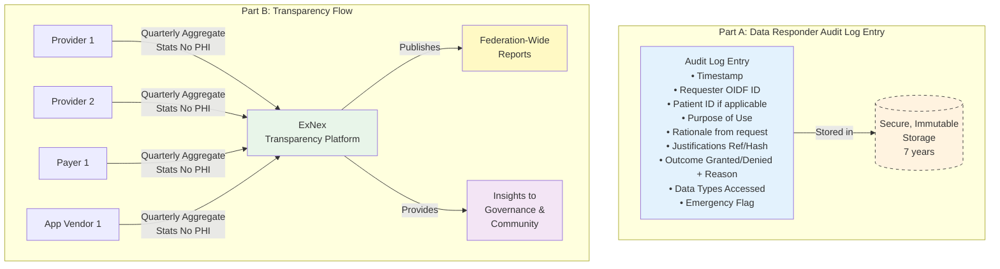

---

## Part 6: Governance and Federation Evolution

A decentralized federation like ExNex, while promoting autonomy, requires a lightweight yet effective governance structure to ensure ongoing interoperability, maintain trust, adapt to new needs, and facilitate orderly evolution. This part outlines the proposed governance principles and key functions for the ExNex Federation.

### 6.1. Guiding the Decentralized Federation: ExNex Governance Principles

The governance approach for ExNex is designed to be minimalist, providing essential oversight and coordination without imposing centralized control over day-to-day operations.

*   **Philosophy: Minimal Central Functions, Maximum Participant Autonomy:**
    *   **Enable, Don't Dictate:** The primary role of ExNex governance is to provide the necessary frameworks, standards, trust anchors, and dispute resolution pathways to enable participants to interoperate effectively and securely.
    *   **Push Complexity to the Edges:** Participants are responsible for managing their own systems, infrastructure, and compliance with federation rules.
    *   **Keep the Core Simple:** Central governance functions are limited to those that are essential for the health, integrity, and evolution of the entire federation.
    *   **Community-Driven Evolution:** The framework anticipates that standards, policies, and operational practices will evolve over time with input from a diverse multi-stakeholder community.

*   **Key Central Governance Functions:**
    The ExNex blueprint proposes a lightweight governing body or foundation responsible for overseeing a few critical central functions:

    1.  **Standards Body:**
        *   **Responsibilities:**
            *   Maintaining and versioning all ExNex technical specifications. This includes Verifiable Credential (VC) schemas, OIDF profiles and ExNex-specific metadata, API specifications (e.g., for RLS, opt-out distribution, patient audit log access), and any common data format or demographic matching guidelines.
            *   Coordinating and managing the process for introducing new versions or updates to these standards, including impact assessment and migration planning.
            *   Operating and maintaining a publicly accessible test sandbox or reference environment where implementers can validate their solutions against ExNex standards.
            *   Facilitating a transparent, multi-stakeholder process for proposing, reviewing, and adopting changes or additions to the standards.
        *   **Goal:** To ensure ongoing technical interoperability, consistency, and the ability for the framework to adapt to new requirements and technologies.

    2.  **Accreditation Function:**
        *   **Responsibilities:**
            *   Developing, maintaining, and managing the certification and accreditation programs for critical trust components within the federation. This primarily includes:
                *   Narrow-Waist (NW) Service Providers (NW-ID, NW-LIC, NW-AUTH, NW-PDC Onboarding Services).
                *   Issuers of Patient-Developer Credentials (PDCs).
            *   Defining the criteria, audit requirements, and operational standards these certified entities must meet and maintain.
            *   Publishing and maintaining an official, up-to-date list of accredited/certified providers. This list would inform the configuration of ExNex Trust Anchors regarding trusted OIDF Intermediates.
            *   Overseeing periodic re-certification and compliance audits of accredited entities.
            *   Investigating significant compliance failures or security incidents involving certified entities, with the authority to suspend or revoke accreditation if necessary.
            *   Maintaining a fair and transparent appeals process related to accreditation decisions.
        *   **Goal:** To ensure that the core trust pillars of the federation (especially NW services that underpin identity, credentialing, and consent) operate to consistently high standards of security, reliability, and trustworthiness.

    3.  **Transparency Platform (as detailed in Section 5.4):**
        *   **Responsibilities:**
            *   Collecting the quarterly, non-PHI aggregate operational statistics submitted by participating organizations.
            *   Analyzing this data to produce and publish federation-wide reports on usage trends, performance benchmarks, adoption rates (e.g., of PDC), and overall ecosystem health.
            *   Providing objective data and insights to the Standards Body, Accreditation Function, and the broader ExNex community to inform policy decisions, identify areas for improvement, and highlight potential systemic issues (e.g., significant operational imbalances).
        *   **Goal:** To provide data-driven oversight and promote accountability and continuous improvement across the federation through transparent operational reporting.

*   **Dispute Resolution:**
    *   While detailed mechanisms will be part of formal participation agreements, ExNex governance will establish a clear, tiered approach for resolving disputes between participants. This will likely emphasize:
        1.  Direct communication and attempted resolution between the involved parties.
        2.  Mediation facilitated by a neutral party under the auspices of the ExNex governance body.
        3.  If necessary, a more formal (but still efficient) arbitration process.
    *   The goal is to provide accessible, fair, and timely mechanisms for resolving conflicts.
    *   *Note: Specifics of dispute resolution are an area for future detailed development within the governance framework.*

*   <diagram>A central organizing diagram for ExNex Governance:
    A central box labeled "ExNex Governance Body / Foundation".
    Arrows point from this central box to three distinct function boxes:
    1.  Box: "Standards Body" with sub-bullets: "Maintains Technical Specs (VCs, OIDF, APIs)", "Manages Versioning", "Operates Test Sandbox", "Facilitates Standards Evolution".
    2.  Box: "Accreditation Function" with sub-bullets: "Certifies NW Service Providers", "Oversees PDC Issuers", "Publishes Accredited Lists", "Manages Compliance Audits".
    3.  Box: "Transparency Platform" with sub-bullets: "Collects Aggregate Operational Stats (No PHI)", "Publishes Federation-Wide Reports", "Monitors Ecosystem Health", "Provides Data for Improvement".
    Surrounding these, and interacting with the ecosystem governed by these functions, are various "ExNex Participant" icons (Hospitals, Clinics, Payer Systems, Patient Apps).
    </diagram>

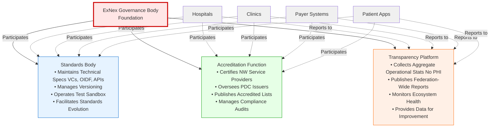

### 6.2. Key Management Considerations

The security and integrity of cryptographic keys are paramount in a system like ExNex, which relies heavily on digital signatures for OIDF Entity Statements, Verifiable Credentials, and secure communication tokens.

*   **Importance:** Proper key management is fundamental to establishing and maintaining trust throughout the federation. Compromised keys can lead to impersonation, unauthorized access, and a loss of confidence in the entire system.
*   **Areas of Focus:**
    *   **Distinction of Key Types:**
        *   **OIDF Federation Entity Keys:** Used by entities to sign their own OIDF Entity Statements (Entity Configurations, Subordinate Statements). These establish the root of an entity's identity within the OIDF trust fabric.
        *   **Protocol-Level Keys:** Used for application-level cryptographic operations. Examples include:
            *   Keys used by Data Requesters to sign their Client Authentication JWTs and Authorization Assertion JWTs. These are typically published in the `jwks` claim within the `metadata.exnex_data_requester` section of their OIDF Entity Configuration.
            *   Keys used by `exnex_trust_mark_issuer` entities (like NW-ID, NW-AUTH) to sign the Verifiable Credentials they issue. These are published in the `jwks` claim within the `metadata.exnex_trust_mark_issuer` section of their OIDF Entity Configuration.
    *   **Lifecycle Management:** Secure generation, distribution (of public keys via OIDF `jwks`), storage, usage, rotation, and revocation/compromise handling for all key types.
    *   **Responsibilities:** Clear delineation of key management responsibilities for individual participants versus any requirements or guidance provided by ExNex governance (e.g., recommended algorithms, key lengths, rotation frequencies).

*   **Future Work:**
    *   *Detailed specifications and best practice guidelines for key management within the ExNex Federation will be developed as a dedicated, critical security document. This will address requirements for all types of participating entities and the keys they manage.*

### 6.3. Future Directions and Collaboration

This document proposes a comprehensive framework for ExNex. The successful realization of this vision will require ongoing collaboration, refinement, and commitment from a diverse community of stakeholders.

*   **Invitation for Feedback:** This proposal is intended to stimulate discussion and gather input from prospective participants, including patients, providers, payers, application developers, and technology vendors. Feedback on the principles, architecture, and operational models described herein is highly encouraged.
*   **Potential Next Steps:**
    *   **Community Building:** Fostering a community around ExNex to refine requirements and drive adoption.
    *   **Pilot Project Planning:** Identifying opportunities for pilot implementations to test and validate key aspects of the framework in real-world or simulated environments.
    *   **Formal Specification Drafting:** Progressing from this framework proposal to detailed, implementable technical specifications for all components, including OIDF profiles, VC schemas, API definitions, and security protocols.
    *   **Development of Reference Implementations and SDKs:** Creating tools to lower the barrier to entry for developers and accelerate adoption.
    *   **Establishment of Governance Structures:** Formally constituting the Standards Body, Accreditation Function, and other necessary governance entities.

ExNex is envisioned as an evolving ecosystem. By establishing a strong, patient-centric foundation built on open standards and clear principles, the aim is to create a health data exchange that is trustworthy, sustainable, and truly serves the needs of individuals and the healthcare community.

### 6.4. Security Considerations

While security is embedded throughout the ExNex framework, this section consolidates key security considerations that require ongoing attention and detailed specification.

*   **VC Theft and Misuse Prevention:**
    *   **TODO:** *Define requirements for VC holder binding mechanisms*
    *   **TODO:** *Specify VC presentation proof requirements (e.g., DPoP-style proofs)*
    *   **TODO:** *Define VC validity periods and refresh procedures*
    *   **TODO:** *Specify requirements for secure VC storage on patient devices*

*   **Token Replay Attack Mitigation:**
    *   **TODO:** *Define requirements for JWT jti tracking and replay prevention*
    *   **TODO:** *Specify maximum token lifetime requirements*
    *   **TODO:** *Define requirements for token binding to TLS sessions*

*   **Audit Log Integrity Requirements:**
    *   **TODO:** *Specify cryptographic requirements for audit log tamper-proofing*
    *   **TODO:** *Define requirements for audit log retention and archival*
    *   **TODO:** *Specify requirements for audit log access controls*
    *   **TODO:** *Define standards for audit log aggregation and analysis*

*   **Incident Response Procedures:**
    *   **TODO:** *Define security incident classification and severity levels*
    *   **TODO:** *Specify notification requirements and timelines*
    *   **TODO:** *Define roles and responsibilities for incident response*
    *   **TODO:** *Specify requirements for incident documentation and reporting*

*   **Compromise Recovery Procedures:**
    *   **TODO:** *Define procedures for handling compromised entity keys*
    *   **TODO:** *Specify VC revocation and reissuance procedures*
    *   **TODO:** *Define procedures for handling compromised NW services*
    *   **TODO:** *Specify patient notification requirements for security breaches*

*   **Additional Security Considerations:**
    *   **TODO:** *Define requirements for secure key generation and storage*
    *   **TODO:** *Specify requirements for secure communication channels (TLS versions, cipher suites)*
    *   **TODO:** *Define requirements for rate limiting and DDoS protection*
    *   **TODO:** *Specify requirements for security monitoring and alerting*

### 6.5. Versioning Strategy

The ExNex framework must evolve while maintaining interoperability across implementations at different version levels.

*   **Framework Version Management:**
    *   **TODO:** *Define semantic versioning approach for ExNex specifications*
    *   **TODO:** *Specify version negotiation mechanisms for protocol interactions*
    *   **TODO:** *Define version discovery mechanisms via OIDF metadata*

*   **Backward Compatibility Requirements:**
    *   **TODO:** *Define minimum support periods for deprecated features*
    *   **TODO:** *Specify requirements for maintaining compatibility with older versions*
    *   **TODO:** *Define clear deprecation policies and timelines*

*   **Migration Procedures:**
    *   **TODO:** *Define procedures for migrating between major versions*
    *   **TODO:** *Specify requirements for parallel operation during transitions*
    *   **TODO:** *Define rollback procedures for failed migrations*

*   **Mixed-Version Environment Handling:**
    *   **TODO:** *Define how entities at different versions interact*
    *   **TODO:** *Specify feature negotiation mechanisms*
    *   **TODO:** *Define minimum baseline version requirements*
    *   **TODO:** *Specify how version mismatches are communicated and handled*

---

## Part 7: Illustrative Use Cases (ExNex in Action)

This section provides concrete examples of how the ExNex framework would function in various common healthcare scenarios. These use cases demonstrate the interplay of different ExNex components, including `purpose_of_use`, `justifications` (VCs and direct claims), the token flow, consent management, and OIDF trust verification.

*(Note: For brevity in this full document generation, I will summarize the key elements of each use case as previously detailed in the individual explainers. The full JWT examples from the explainers would be included in a final version of this section.)*

### 7.1. Patient-Directed Access: IAS and PDC Apps (Based on Explainer 7)
*   **Scenario Overview:**
    *   **IAS App (e.g., "HealthVista"):** A patient, Alice, uses a third-party app to aggregate her records. She has previously undergone IAL2 identity verification (obtaining an `nw_id_vc_v1`) and explicitly authorized HealthVista via an NW-AUTH service (obtaining an `exnex_nw_auth_vc_v1`).
    *   **PDC App (e.g., "MyRecordViewer"):** A patient, Bob, uses his personal app with his `exnex_pdc_vc_v1` (obtained after IAL2 identity verification).
*   **`Purpose of Use`:** `IndividualAccess` for both.
*   **Key `Justifications`:**
    *   IAS App: Presents Alice's `nw_id_vc_v1` AND the `exnex_nw_auth_vc_v1` (linking Alice to HealthVista with specific permissions).
    *   PDC App: Presents Bob's `exnex_pdc_vc_v1` (combining identity and broad self-access rights).
*   **Flow Highlights:**
    *   Both apps use the ExNex Token Flow (Client Authentication JWT with OIDF `trust_chain`, Authorization Assertion JWT with justifications).
    *   Responders verify the app's OIDF identity and the presented VCs.
    *   For IAS, Responder enforces scope from `exnex_nw_auth_vc_v1`. For PDC, broad access to self-data is granted.
    *   Audit logs capture access, including the `rationale`.

### 7.2. Clinical and Payer Operations (Based on Explainer 8)
*   **Scenario C: Provider-to-Provider Access for Treatment**
    *   Dr. Ellis (Cardio Clinic) needs records for patient David Lee from General Hospital.
    *   **`Purpose of Use`:** `Treatment`.
    *   **Key `Justification`:** Cardio Clinic asserts a `provider_treatment_relationship_v1` (direct claim) including patient demographics for matching and attestation of the relationship.
    *   **Flow Highlights:** General Hospital verifies Cardio Clinic's OIDF identity, processes the justification, checks for David Lee's "Treatment" opt-out (assumed none), and returns data.
*   **Scenario D: Payer Access for Care Gap Closure (Single Patient, Treatment)**
    *   HealthFirst Insurance needs A1c results for member Carol White from Community Clinic for a diabetes care gap program.
    *   **`Purpose of Use`:** `Treatment` (as care coordination falls under this).
    *   **Key `Justification`:** HealthFirst asserts a `beneficiary_treatment_relationship_v1` (direct claim) with member identifiers and program context.
    *   **Flow Highlights:** Community Clinic verifies HealthFirst's OIDF identity, processes justification, checks Carol White's "Treatment" opt-out, and returns data.
*   **Scenario E: Payer Group Data for Population Health Management**
    *   Statewide Health Plan needs data for its attributed members from Metro Health System for quality reporting.
    *   **`Purpose of Use`:** `PopulationHealthManagement` (or `PaymentOperations` if directly tied to value-based payment).
    *   **Key `Justification`:** Statewide Health Plan asserts a `payer_attributed_member_cohort_v1` (direct claim), referencing attribution period and the underlying Data Sharing Agreement.
    *   **Flow Highlights:** Metro Health System verifies Payer's OIDF identity, checks for prior agreement (as this is an "Optional Response" purpose), processes justification. If approved, likely triggers a FHIR Bulk Data export for the cohort, respecting individual member opt-outs if applicable to this purpose.

### 7.3. Research Access (Based on Explainer 9)
*   **Scenario Overview:** "Diabetes_Outcomes_Study_App" requests data for participant Emily Chen from University Hospital.
*   **`Purpose of Use`:** `Research`.
*   **Key `Justifications`:**
    *   Emily Chen's `nw_id_vc_v1` (for identity).
    *   An `exnex_research_consent_vc_v1` (attesting to Emily's informed consent for this specific study, referencing IRB approval, and detailing data scope/constraints). Issued by a trusted Research Consent Authority/NW-AUTH.
*   **Flow Highlights:**
    *   Research App uses ExNex Token Flow.
    *   University Hospital verifies App's OIDF identity, the Identity VC, and the Research Consent VC.
    *   Checks for a prior agreement with the research entity (as "Research" is an "Optional Response" purpose).
    *   Strictly adheres to data scope and constraints (e.g., date ranges, de-identification) specified in the Research Consent VC.
    *   Audit logs capture access with research-specific details.

### 7.4. Emergency Access / "Break-Glass" (Based on Explainer 16)
*   **Scenario Overview:** Unconscious patient arrives at ED. Patient had previously opted out of *routine* `Treatment` sharing.
*   **`Purpose of Use`:** `Emergency` (distinct from `Treatment`).
*   **Key `Justifications`:** Similar to `Treatment` (e.g., provider identity/license VCs, asserted relationship if determinable), but clearly flagged for the "Emergency" purpose.
*   **Flow Highlights:**
    *   ED system invokes `purpose_of_use: "Emergency"`.
    *   Data Responder checks against the **separate `Emergency` opt-out list/API** (managed by NW-AUTH). Assume patient has *not* opted out of this specific emergency sharing.
    *   Access is granted.
    *   Access is logged with heightened scrutiny, flagged as "Emergency/Break-Glass." Patient (or representative) notified when appropriate.
    *   If the patient *had* opted out of emergency access, a "Safety Override" policy might be considered in extreme, life-threatening situations, triggering even more stringent auditing and justification.

---

## Appendices

### A. Glossary of Terms

*(This section would contain clear, concise definitions for key terms used throughout the document, such as:)*

*   **AAL2 (Authenticator Assurance Level 2):** A level of authenticator assurance defined by NIST.
*   **API (Application Programming Interface):** A set of rules and protocols for building and interacting with software applications.
*   **Authorization Assertion JWT:** A JWT presented by a Data Requester in ExNex, detailing the purpose, rationale, and justifications for a data access request.
*   **Bloom Filter:** A probabilistic data structure used in ExNex for privacy-preserving distribution of opt-out preferences.
*   **Client Authentication JWT:** A JWT presented by a Data Requester in ExNex to authenticate itself to a Data Responder's token endpoint, containing its OIDF trust chain.
*   **Data Requester:** An ExNex entity initiating a request for health data.
*   **Data Responder:** An ExNex entity holding health data and processing access requests.
*   **ExNex (ExchangeNext):** The name of the proposed health data sharing framework.
*   **FHIR (Fast Healthcare Interoperability Resources):** A standard for exchanging healthcare information electronically.
*   **IAL2 (Identity Assurance Level 2):** A level of identity proofing assurance defined by NIST.
*   **IAS (Identity Assured Service) Application:** A third-party application that a patient explicitly authorizes to access their data, typically involving an Identity VC and an Authorization VC.
*   **JWT (JSON Web Token):** A compact, URL-safe means of representing claims to be transferred between two parties.
*   **Justification:** Verifiable attestations presented by a Data Requester to support its access request.
*   **Narrow-Waist (NW) Service Provider:** A certified ExNex entity offering specialized, trusted services like identity verification (NW-ID), consent management (NW-AUTH), etc.
*   **NW-AUTH:** Narrow-Waist Authorization Service.
*   **NW-ID:** Narrow-Waist Identity Provider.
*   **NW-LIC:** Narrow-Waist Licensure Provider.
*   **NW-PDC Onboarding Service:** A service facilitating the issuance of Patient-Developer Credentials.
*   **OIDF (OpenID Federation 1.0):** An open standard used by ExNex for establishing dynamic, multilateral trust between entities.
    *   **Entity (OIDF):** A participant in an OpenID Federation.
    *   **Entity Configuration (OIDF):** A signed statement an OIDF Entity publishes about itself.
    *   **Entity Identifier (OIDF):** A unique HTTPS URL identifying an OIDF Entity.
    *   **Subordinate Statement (OIDF):** A signed statement an OIDF Superior issues about a Subordinate.
    *   **Trust Anchor (OIDF):** The root of trust in an OpenID Federation.
    *   **Trust Chain (OIDF):** A verifiable sequence of OIDF Entity Statements linking an Entity to a Trust Anchor.
*   **Patient-Developer Credential (PDC):** A Verifiable Credential enabling individuals to programmatically access their own health data within ExNex.
*   **PDC VC (Patient-Developer Credential Verifiable Credential):** The specific VC format for PDCs (schema `exnex_pdc_vc_v1`).
*   **Purpose of Use (PoU):** The declared reason for a data access request in ExNex.
*   **Rationale:** A human-readable explanation accompanying a data access request, visible in audit logs.
*   **RLS (Record Locator Service):** A service that helps Data Requesters discover where a patient's data might reside.
*   **VC (Verifiable Credential):** A tamper-evident credential containing claims about a subject, issued by an issuer, and cryptographically verifiable.

---

### B. Frequently Asked Questions (FAQ)

This section addresses common questions about the ExNex framework, its design, and its operation.

**General Architecture & Core Concepts**

*   **Q: What is the primary focus of the ExNex framework?**
    A: ExNex is a patient-centric health data sharing framework. Its primary focus is to empower individuals with direct access to and control over their health information, while also ensuring that clinicians, payers, and other authorized entities can securely and efficiently access data for legitimate, consented purposes. It establishes a standardized "trust and transport" layer for health data exchange.

*   **Q: How do Network Record Locator Services (RLS) and Direct Edge Access work together?**
    A: ExNex supports both. Networks (which are ExNex OIDF Entities themselves) can offer RLS to help Data Requesters discover *where* a patient's data might reside (i.e., which Data Responders hold records). The RLS returns pointers (e.g., OIDF Entity IDs or service URLs of Responders, and optionally endpoint-specific patient IDs). The Requester then uses Direct Edge Access – initiating the ExNex Authorization Token Flow directly with the identified Responder(s) – to actually retrieve the data. Some Requesters might bypass RLS if they already know the Responder's location. Both patterns use the same underlying ExNex trust fabric (OIDF, VCs) and token flow for data retrieval.

*   **Q: Why does ExNex use a "Narrow-Waist (NW) Model" for certain services?**
    A: The Narrow-Waist model dramatically reduces complexity and enhances trust. Instead of every participant needing to independently verify credentials from countless sources (e.g., 50+ state medical boards, numerous identity proofing services), they primarily need to trust and integrate with a small, certified set of NW Service Providers (e.g., NW-ID for identity, NW-LIC for licensure, NW-AUTH for consent). These NW providers handle the specialized, complex tasks, ensuring consistency and scalability for the entire federation.

*   **Q: How does ExNex establish trust between participants who don't know each other?**
    A: ExNex uses the OpenID Federation 1.0 (OIDF) standard. Each participant (Requester, Responder, NW Service) is an OIDF Entity with a unique identifier and publishes a signed "Entity Configuration." Trust is established dynamically by validating a "Trust Chain" of these signed statements, linking an entity back to a common, recognized ExNex Trust Anchor. This allows a Data Responder, for example, to verify the identity and authorized capabilities of an unfamiliar Data Requester on demand.

*   **Q: What are "Justifications" and why are they important?**
    A: Justifications are verifiable attestations presented by a Data Requester along with their `purpose_of_use` and `rationale`. They prove the Requester's legitimacy and authorization for the specific request. Justifications can be Verifiable Credentials (VCs) issued by trusted NW services (e.g., an Identity VC, a Consent VC) or, in some cases, direct claims made by an OIDF-trusted organizational requester. They are essential for ensuring that data access is appropriate and authorized.

**Economics and Sustainability**

*   **Q: If Responders can't charge for mandatory data access, how do they cover their costs?**
    A: For mandatory response purposes (like `IndividualAccess`, `Treatment`, `Emergency`, `PublicHealth`), Data Responders are expected to budget for their query response infrastructure as a normal operational IT expense, similar to how they fund other essential systems. The burden of responding to these queries naturally scales with the size of the patient population an organization serves. For optional purposes (like `Research` or some `PaymentOperations`), Responders can enter into agreements with Requesters that may include cost-sharing or fees.

*   **Q: What prevents large organizations from overwhelming smaller ones with queries for mandatory purposes?**
    A: The infrastructure burden for mandatory responses is primarily related to an organization's *own* patient population. A small rural clinic will naturally receive far fewer queries about its patients than a large urban health system. The quarterly aggregate transparency reports will help monitor for any significant imbalances. For *optional* purposes where query volume could be a concern, smaller organizations can decline to participate without prior agreements that address their operational capacity and costs.

*   **Q: Why are some `purposes_of_use` mandatory to respond to, while others are optional?**
    A: The framework distinguishes between core functions essential for patient care, patient rights, and public safety, versus other valuable but more elective data uses. Direct patient care (`Treatment`), patient access to their own data (`IndividualAccess`), urgent safety situations (`Emergency`), and legally required reporting (`PublicHealth`) create fundamental obligations for Data Responders. Other purposes like `Research` or certain `PaymentOperations` represent voluntary participation, allowing organizations to manage their resources and enter into specific agreements.

**Privacy and Consent**

*   **Q: How does ExNex handle patient consent?**
    A: Consent management is central to ExNex, primarily facilitated by NW-AUTH services. For purposes like `Research` or authorizing a third-party app, explicit patient opt-in is required, often attested by an Authorization VC. For purposes like routine `Treatment` or `Emergency`, a default-allow (opt-out) model is used, where patients can choose to restrict sharing. These opt-out preferences are distributed to Responders in a privacy-preserving way (e.g., via Bloom filters and a verification API).

*   **Q: Can patients really opt out of their data being shared for `Treatment`?**
    A: Yes, ExNex technically enables patients to opt out of sharing their data for routine `Treatment` purposes. If a patient makes this choice, Data Responders are obligated to honor it for such requests. Healthcare providers should, of course, counsel patients about the potential implications of such an opt-out on their care. Emergency access has a separate opt-out mechanism and potential safety overrides.

*   **Q: How are Bloom filters for opt-outs privacy-preserving?**
    A: Bloom filters used for opt-out distribution do not contain actual patient identifiers. Instead, they contain hashes of various combinations of patient demographic data. A Bloom filter can indicate if a hash *might* be in the set (a potential opt-out, which may require a definitive API check) or *definitely is not*. They have a small chance of false positives but no false negatives. This means you cannot extract original patient data or enumerate opted-out patients from the filter itself.

*   **Q: How does patient matching work if there isn't a universal patient ID?**
    A: ExNex supports robust patient matching through several mechanisms. When available, high-assurance Verifiable Credentials like the Patient-Developer Credential (PDC VC) or an NW Identity VC (both containing NIST IAL2 verified demographics) can be used by Responders for accurate matching. In scenarios where these are not presented with the initial query, the framework supports demographic-based matching using combinations of attributes like name, date of birth, phone number, etc., provided as part of the request's justifications.

**TODO: Patient Matching Requirements**
*The framework requires additional guidance on:*
- *Minimum matching criteria and required demographic fields*
- *Standardized approaches for handling name changes (e.g., maiden names)*
- *Recommended matching algorithms and confidence thresholds*
- *Guidelines for handling edge cases and ambiguous matches*

**Technical Implementation & Security**

*   **Q: How is a Data Requester authenticated during the token flow?**
    A: A Data Requester authenticates to a Data Responder's token endpoint by presenting a **Client Authentication JWT**. This JWT is signed by the Requester's protocol-specific private key. Crucially, this JWT also contains the Requester's OIDF **`trust_chain`**, allowing the Responder to dynamically verify the Requester's identity and its OIDF-asserted metadata (including its public protocol key) by validating the chain back to a trusted ExNex Trust Anchor. This enables "Automatic Registration."

*   **Q: What prevents a Data Requester from falsely claiming a patient relationship or requesting data without proper authorization?**
    A: Several layers address this:
    1.  **OIDF Verification:** The Requester must first be a verifiable OIDF entity within the ExNex federation. Its capabilities (e.g., allowed `purposes_of_use`, allowed `justification_schemas`) can be restricted by OIDF `metadata_policy` set by its OIDF superiors.
    2.  **Justifications:** The Requester must provide specific, verifiable `justifications` appropriate for the claimed `purpose_of_use`. For many scenarios, these are VCs issued by trusted NW services (e.g., an Authorization VC from NW-AUTH proving patient consent).
    3.  **Responder Validation:** The Data Responder verifies all VCs, checks them against the patient and purpose, and enforces consent rules.
    4.  **Auditability:** All requests, justifications, and rationales are logged, providing a strong deterrent and means of investigation. Misuse can lead to OIDF entity revocation and other penalties.

*   **Q: How does ExNex handle emergency access ("Break-Glass") when consent systems might otherwise block critical care?**
    A: ExNex has a distinct `purpose_of_use: Emergency`. Patients have a *separate* opt-out choice for this purpose, distinct from routine `Treatment` opt-outs. This allows a patient to opt-out of routine sharing but still permit emergency access. If no emergency opt-out is active, access is mandatory for Responders. In extreme, life-threatening situations where an emergency opt-out *is* active, federation policy may allow for a "safety override," which would trigger significantly heightened auditing, justification, and notification requirements.

**Patient-Developer Credential (PDC) Program**

*   **Q: Why is there a special Patient-Developer Credential (PDC) program?**
    A: The PDC program is designed to give individuals direct, programmatic, and low-fee access to their *own* health data across the federation. Current systems often make this difficult or route patients through commercial intermediaries. The PDC (an `exnex_pdc_vc_v1`) is a patient-held Verifiable Credential, obtained after strong identity proofing, that acts as a powerful "master key" for an individual to access their own records using apps they control.

*   **Q: What stops someone from using a PDC VC to access someone else's data?**
    A: The PDC VC is cryptographically bound to the specific individual's IAL2-verified identity (including their verified demographics). When a PDC VC is presented to a Data Responder, the Responder matches the data request against the verified identity asserted *within that PDC VC*. It only grants access to the records matching that specific individual. All access is also audited.

*   **Q: Can apps using a PDC VC be commercialized?**
    A: The PDC VC itself is intended for the patient's personal use in accessing their own data. If an app developer wants to build a commercial application that helps patients access data using their PDCs, the model would typically be that the patient uses their PDC with the app to retrieve their data, and then the patient *chooses* if and how to share that retrieved data *with or through* the commercial service. The PDC facilitates the patient getting their data; subsequent sharing is a separate decision. The app itself, if acting as an OIDF entity, would also be subject to OIDF policies.

*   **Q: Does every PDC app instance need separate OIDF registration?**
    A: Yes, each PDC app instance that needs to make authenticated requests as an OIDF entity must have its own registration. However, the framework supports streamlined models:
    - **Personal-use apps**: Can be registered through the NW-PDC Service during onboarding, which automatically applies appropriate OIDF policies (e.g., restricting to `IndividualAccess` only)
    - **Runtime federation**: PDC apps will be supplied with federation assertions at runtime, enabling automatic registration with data responders without manual pre-configuration
    - **Simplified model**: For purely personal-use apps that only present the patient's PDC VC, minimal OIDF overhead is required as the trust primarily derives from the PDC VC itself

**Governance and Evolution**

*   **Q: Who makes decisions about changes to ExNex standards?**
    A: The ExNex governance structure includes a Standards Body. This body will facilitate a multi-stakeholder process for proposing, reviewing, and adopting changes or additions to technical specifications. This typically involves public comment periods and input from providers, payers, patient advocates, app developers, and technical experts.

*   **Q: Can ExNex interoperate with existing networks like TEFCA or other HIEs?**
    A: Yes, ExNex is designed to be compatible and complementary. Existing networks (like HIEs or entities participating in TEFCA as QHINs) can become ExNex OIDF Entities. They could act as RLS providers within ExNex, and their participating members could adopt ExNex standards for direct edge access. The OIDF trust framework and the VC-based justification model can enhance the security and interoperability of existing exchange patterns.

---

## Appendix C: Example JSON Artifacts

This appendix provides illustrative examples of key JSON-based artifacts used within the ExNex framework, such as OIDF Entity Configuration snippets, Client Authentication JWTs, Authorization Assertion JWTs, and Verifiable Credentials. These are not exhaustive but aim to clarify the structure and content.

*(**Note on Keys:** Ellipses `...` in key fields like `"x": "..."` represent the actual base64url-encoded key material. Full key pairs are not shown for brevity. JWK "kid" (Key ID) values are illustrative and should be unique within their respective JWKS.)*

### C.1. Example OIDF Entity Configuration Snippets

**(C.1.1) `exnex_data_requester` (e.g., a Patient App - "MyHealthJourney")**
```json
// Found at https://myhealthjourney.apps.pdc.exnex.org/.well-known/openid-federation
{
  "iss": "https://myhealthjourney.apps.pdc.exnex.org",
  "sub": "https://myhealthjourney.apps.pdc.exnex.org",
  "iat": 1670000000,
  "exp": 1700000000,
  "jwks": { // OIDF Federation Keys
    "keys": [
      {
        "kty": "EC",
        "kid": "mhj_oidf_sign_key_v1",
        "crv": "P-256",
        "x": "...",
        "y": "..."
      }
    ]
  },
  "authority_hints": ["https://nw-pdc-service.exnex.org"],
  "metadata": {
    "federation_entity": {
      "organization_name": "MyHealthJourney App (Personal Use)",
      "contacts": ["support@myhealthjourney.example.com"],
      "policy_uri": "https://myhealthjourney.apps.pdc.exnex.org/policy",
      "logo_uri": "https://myhealthjourney.apps.pdc.exnex.org/logo.png"
    },
    "exnex_data_requester": {
      "display_name": "MyHealthJourney Personal Health App",
      "software_id": "com.example.myhealthjourney",
      "software_version": "2.0.1",
      "jwks": { // Protocol Keys
        "keys": [
          {
            "kty": "EC",
            "kid": "mhj_proto_auth_key_v1_es256",
            "use": "sig",
            "alg": "ES256",
            "crv": "P-256",
            "x": "...",
            "y": "..."
          }
        ]
      },
      "allowed_purposes_of_use": ["IndividualAccess"],
      "allowed_justification_schemas": ["exnex_pdc_vc_v1"],
      "token_endpoint_auth_methods_supported": ["private_key_jwt"],
      "token_endpoint_auth_signing_alg_values_supported": ["ES256"]
    }
  }
}
// Signed by mhj_oidf_sign_key_v1
```

**(C.1.2) `exnex_data_responder` (e.g., a Hospital System - "City General Hospital")**
```json
// Found at https://citygeneral.exnex.org/.well-known/openid-federation
{
  "iss": "https://citygeneral.exnex.org",
  "sub": "https://citygeneral.exnex.org",
  "iat": 1671000000,
  "exp": 1701000000,
  "jwks": { /* City General's OIDF Federation Keys */ },
  "authority_hints": ["https://regional-health-trust.exnex.org"],
  "metadata": {
    "federation_entity": {
      "organization_name": "City General Hospital Network",
      "contacts": ["interop-team@citygeneral.exnex.org"],
      "homepage_uri": "https://citygeneral.exnex.org"
    },
    "exnex_data_responder": {
      "display_name": "City General Hospital Data Services",
      "token_endpoint": "https://api.citygeneral.exnex.org/oauth/token",
      "fhir_api_endpoint": "https://api.citygeneral.exnex.org/fhir/r4", // Patient audit logs via FHIR AuditEvent queries here
      "token_endpoint_auth_methods_supported": ["private_key_jwt"],
      "token_endpoint_auth_signing_alg_values_supported": ["ES256", "RS256"],
      "supported_purposes_of_use": [
        "IndividualAccess",
        "Treatment",
        "Emergency",
        "PublicHealth",
        "PaymentOperations"
      ],
      "supported_justification_schemas": [
        "exnex_pdc_vc_v1",
        "nw_id_vc_v1",
        "exnex_nw_auth_vc_v1",
        "provider_treatment_relationship_v1",
        "beneficiary_payment_relationship_v1"
      ]
      // No separate patient_audit_log_fhir_endpoint_suffix; access via fhir_api_endpoint/AuditEvent
    }
  }
}
// Signed by City General's OIDF Federation Key
```

**(C.1.3) `exnex_trust_mark_issuer` (e.g., NW-ID Service - "VeriTrust ID")**
```json
// Found at https://veritrust-id.exnex.org/.well-known/openid-federation
{
  "iss": "https://veritrust-id.exnex.org",
  "sub": "https://veritrust-id.exnex.org",
  "iat": 1672000000,
  "exp": 1702000000,
  "jwks": { /* VeriTrust ID's OIDF Federation Keys */ },
  "authority_hints": ["https://exnex-trust-anchor.exnex.org"],
  "metadata": {
    "federation_entity": {
      "organization_name": "VeriTrust National Identity Service",
      "contacts": ["ops@veritrust-id.exnex.org"]
    },
    "exnex_trust_mark_issuer": {
      "display_name": "VeriTrust Certified NW Identity Service",
      "issued_credential_types": [
        "ExNexIdentityCredential_v1.0",
        "ExNexPatientDeveloperCredential_v1.0"
      ],
      "jwks": { // Protocol Keys used by VeriTrust ID to SIGN the VCs it issues
        "keys": [
          {
            "kty": "EC",
            "kid": "veritrust_vc_sign_key_p256_v1",
            "use": "sig",
            "alg": "ES256",
            "crv": "P-256",
            "x": "...",
            "y": "..."
          }
        ]
      },
      "credential_status_endpoint": "https://api.veritrust-id.exnex.org/vc/status/v1"
    }
  }
}
// Signed by VeriTrust ID's OIDF Federation Key
```

### C.2. Example Client Authentication JWT Payload

(Sent by "MyHealthJourney" app to "City General Hospital's" token endpoint)

```json
{
  "iss": "https://myhealthjourney.apps.pdc.exnex.org",
  "sub": "https://myhealthjourney.apps.pdc.exnex.org",
  "aud": "https://api.citygeneral.exnex.org/oauth/token",
  "jti": "client-authn-jwt-mhj-cgh-20240715103000-xyz123",
  "exp": 1721035900, // Example: UNIX timestamp for 2024-07-15T10:31:40Z
  "iat": 1721035600, // Example: UNIX timestamp for 2024-07-15T10:26:40Z
  "trust_chain": [
    "eyJhbGciOiJFUzI1NiIsImtpZCI6Im1oal9vaWRmX3NpZ25fa2V5X3YxIn0...", // MyHealthJourney's Entity Config
    "eyJhbGciOiJFUzI1NiIsImtpZCI6Im53X3BkY19vaWRmX3NpZ25fa2V5X3YxIn0...", // Subordinate Stmt for MyHealthJourney from NW-PDC
    // ... other JWTs in the chain ...
    "eyJhbGciOiJFUzI1NiIsImtpZCI6ImV4bmV4X3RhX29pZGZfc2lnbl9rZXlfdjEifQ..." // ExNex TA's Entity Config
  ]
}
// Signed by MyHealthJourney's protocol key (e.g., mhj_proto_auth_key_v1_es256)
```

### C.3. Example Authorization Assertion JWT Payload

(Sent by "MyHealthJourney" app for patient Carol Woods to access her data from "City General Hospital")

```json
{
  "iss": "https://myhealthjourney.apps.pdc.exnex.org",
  "sub": "https://myhealthjourney.apps.pdc.exnex.org",
  "aud": "https://citygeneral.exnex.org", // Audience is the Responder's OIDF Entity ID
  "jti": "authz-assert-jwt-mhj-cgh-carolw-20240715103005-abc789",
  "exp": 1721036205, // Example: UNIX timestamp for 2024-07-15T10:36:45Z
  "iat": 1721035905, // Example: UNIX timestamp for 2024-07-15T10:31:45Z
  "purpose_of_use": "IndividualAccess",
  "rationale": "Carol Woods (PDC User) is using MyHealthJourney app to retrieve her latest lab results and visit summaries from City General Hospital.",
  "justifications": [
    {
      "type": "exnex_pdc_vc_v1",
      "credential": {
        // Compact serialized PDC VC JWT for Carol Woods (see C.4.1 for example payload)
        "jws": "eyJhbGciOiJFUzI1NiIsImtpZCI6InZlcml0cnVzdF92Y19zaWduX2tleV9wMjU2X3YxIiwidHlwIjoidmMrand0In0.eyJpc3MiOiJodHRwczovL3Zlcml0cnVzdC1pZC5leG5leC5vcmciLCJzdWIiOiJ1cm46dmVyaXRydXN0LWlkOnBkYy1wYXRpZW50OnV1aWQ6Y2Fyb2x3MjAyNCIsImp0aSI6InBkY192Y19jYXJvbHdfMjAyNDA3MTUiLCJleHAiOjE3NTI1NzE5MDUsImlhdCI6MTcyMTAzNTkwNSwidmMiOnsiQGNvbnRleHQiOlsiaHR0cHM6Ly93d3cudzMub3JnLzIwMTgvY3JlZGVudGlhbHMvdjEiXSwiaWQiOiJ1cm46dXVpZDpjcmVkLXBsYy1jYXJvbHctMDAxIiwidHlwZSI6WyJWZXJpZmlhYmxlQ3JlZGVudGlhbCIsIkV4bmV4UGF0aWVudERldmVsb3BlckNyZWRlbnRpYWwiXSwiaXNzdWVyIjoiaHR0cHM6Ly92ZXJpdHJ1c3QtaWQuZXhuZXgub3JnIiwiaXNzdWFuY2VEYXRlIjoiMjAyNC0wNy0xNVQxMDoxMTo0NVoifX0.c2lnbmF0dXJlX2hlcmU..."
      }
    }
  ]
}
// Signed by MyHealthJourney's protocol key (e.g., mhj_proto_auth_key_v1_es256)
```

### C.4. Example Verifiable Credential Payloads (Illustrative Content of the VC JWT's `vc` claim)

**C.4.1. NW Patient-Developer Credential (PDC) VC - `exnex_pdc_vc_v1`**
(Issued by "VeriTrust ID" to patient Carol Woods. This is the payload of the `vc` claim inside the signed PDC VC JWT.)

```json
{
  "@context": [
    "https://www.w3.org/2018/credentials/v1",
    "http://hl7.org/fhir/context.jsonld" // For FHIR Patient structure
  ],
  "id": "urn:uuid:cred-pdc-carolw-001",
  "type": ["VerifiableCredential", "ExNexPatientDeveloperCredential"],
  "issuer": "https://veritrust-id.exnex.org",
  "issuanceDate": "2024-07-15T10:11:45Z",
  "expirationDate": "2025-07-15T10:11:45Z",
  "credentialSubject": {
    "id": "urn:veritrust-id:pdc-patient:uuid:carolw2024", // Stable patient identifier for PDC context
    "ial_level": "ial2",
    "verified_demographics": { // FHIR Patient resource structure
      "resourceType": "Patient",
      "name": [
        {
          "use": "official", // Current legal name
          "family": "Woods",
          "given": ["Carol", "Anne"]
        },
        {
          "use": "maiden", // Previous name
          "family": "Smith",
          "given": ["Carol", "Anne"],
          "period": { "end": "2018-06-15" } // Optional period when this name was valid
        }
      ],
      "telecom": [
        { "system": "phone", "value": "+15558001112", "use": "mobile" },
        { "system": "email", "value": "carol.woods@example.com", "use": "home" }
      ],
      "gender": "female",
      "birthDate": "1990-05-25",
      "address": [
        {
          "use": "home",
          "type": "physical",
          "line": ["789 Elk Haven"],
          "city": "Newport",
          "state": "RD",
          "postalCode": "03200",
          "country": "US"
        }
      ]
    },
    "granted_permissions": {
      "access_type": "exnex_data_access_parameters_v1",
      "constraints": null // Signifies no specific constraints for self-access
    }
  }
}
// This VC payload is part of a JWT signed by VeriTrust ID's VC signing protocol key
```

**C.4.2. NW Identity Credential VC - `nw_id_vc_v1`**
(Issued by "VeriTrust ID" to patient Emily Carter. For use with an IAS app.)

```json
{
  "@context": [
    "https://www.w3.org/2018/credentials/v1",
    "http://hl7.org/fhir/context.jsonld"
  ],
  "id": "urn:uuid:cred-identity-emilyc-002",
  "type": ["VerifiableCredential", "ExNexIdentityCredential"],
  "issuer": "https://veritrust-id.exnex.org",
  "issuanceDate": "2024-05-01T11:20:00Z",
  "expirationDate": "2026-05-01T11:20:00Z",
  "credentialSubject": {
    "id": "urn:veritrust-id:patient:uuid:emilyc2024", // Stable patient identifier
    "ial_level": "ial2",
    "aal_level": "aal2",
    "verified_demographics": { // FHIR Patient resource structure
      "resourceType": "Patient",
      "identifier": [
        {
          "use": "official",
          "type": {"text": "Identity Proofing Source Record ID"},
          "system": "urn:veritrust-id:source:id",
          "value": "IDP76543EMILY"
        }
      ],
      "name": [
        {
          "use": "official",
          "family": "Carter",
          "given": ["Emily", "Jane"]
        },
        {
          "use": "maiden",
          "family": "Williams",
          "given": ["Emily", "Jane"],
          "period": { "end": "2015-10-20" }
        }
      ],
      "telecom": [
        { "system": "phone", "value": "+15559003334", "use": "home" }
      ],
      "gender": "female",
      "birthDate": "1985-11-02",
      "address": [
        {
          "use": "home",
          "type": "physical",
          "line": ["123 Oak Street", "Apt 4B"],
          "city": "Metropolis",
          "state": "NY",
          "postalCode": "10001",
          "country": "US"
        }
      ]
    }
  }
}
// This VC payload is part of a JWT signed by VeriTrust ID's VC signing protocol key
```

**C.4.3. NW Authorization Credential VC - `exnex_nw_auth_vc_v1`**
(Issued by "ConsentGuard NW-AUTH" for Emily Carter, authorizing "HealthSync Pro" app)

```json
{
  "@context": ["https://www.w3.org/2018/credentials/v1"],
  "id": "urn:uuid:cred-authz-emilyc-healthsync-003",
  "type": ["VerifiableCredential", "ExNexAuthorizationCredential"],
  "issuer": "https://consentguard-auth.exnex.org",
  "issuanceDate": "2024-07-10T16:45:00Z",
  "expirationDate": "2025-01-10T16:45:00Z",
  "credentialSubject": {
    "id": "urn:veritrust-id:patient:uuid:emilyc2024", // Patient identifier (matches Identity VC)
    "authorized_party": "https://healthsyncpro.apps.exnex.org", // App's OIDF Entity ID
    "granted_permissions": {
      "access_type": "exnex_data_access_parameters_v1",
      "purposes_of_use_allowed": ["IndividualAccess"], // Explicitly allowing IndividualAccess
      "constraints": {
        "event_date_range": { "start_date": "2022-01-01", "end_date": null }, // Data since Jan 1, 2022
        "source_data_jurisdictions": ["US-NY", "US-CA"], // Only from these states
        "allowed_fhir_resource_types": ["Patient", "Observation", "Condition", "Encounter"]
      }
    },
    "consent_receipt_id": "urn:consentguard:consent:uuid:emilyc-healthsync-consent-07102024"
  }
}
// This VC payload is part of a JWT (where JWT "sub" is Emily's ID, JWT "aud" is HealthSync Pro's ID)
// signed by ConsentGuard NW-AUTH's VC signing protocol key
```

### C.5. Example Direct Claim Justification Object
(As part of the `justifications` array in an Authorization Assertion JWT for Provider-to-Provider Treatment, requesting data for Emily Carter nee Williams)

```json
// Within the "justifications" array:
{
  "type": "provider_treatment_relationship_v1",
  "patient": { // FHIR Patient resource for matching by the Responder
    "resourceType": "Patient",
    "name": [
      {
        "use": "official", // Current legal name known to requester
        "family": "Carter",
        "given": ["Emily", "Jane"]
      },
      {
        "use": "maiden", // Previous name, useful if Responder's system has old records
        "family": "Williams",
        "given": ["Emily", "Jane"]
      }
    ],
    "birthDate": "1985-11-02",
    "gender": "female",
    "identifier": [ // Known identifiers at the target Responder, if available
      {
        "use": "usual",
        "type": {
          "coding": [
            { "system": "http://terminology.hl7.org/CodeSystem/v2-0203", "code": "MR" }
          ],
          "text": "Medical Record Number"
        },
        "system": "urn:oid:targetregionalhospital.example.org:mrn",
        "value": "TRH-EC-5551212"
      }
    ],
    "address": [ // Current address known to requester
      {
        "use": "home",
        "line": ["123 Oak Street", "Apt 4B"],
        "city": "Metropolis",
        "state": "NY",
        "postalCode": "10001"
      }
    ]
  },
  "provider": { // Clinician or organization at the requesting entity
    "identifier": {
      "system": "http://hl7.org/fhir/sid/us-npi",
      "value": "9876543210" // Example NPI of requesting clinician/org
    },
    "display": "Dr. Primary Care Physician - Metro Clinic"
  },
  "relationship_context": "Referral for specialist consultation regarding patient Emily Carter's ongoing migraines. Patient has appointment on 2024-07-25."
}
```
